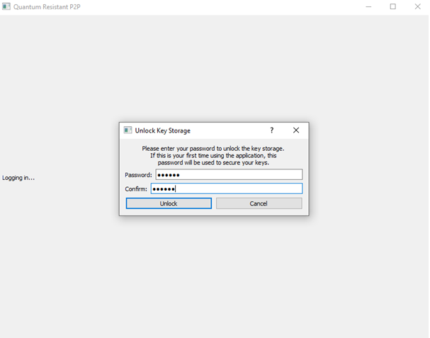
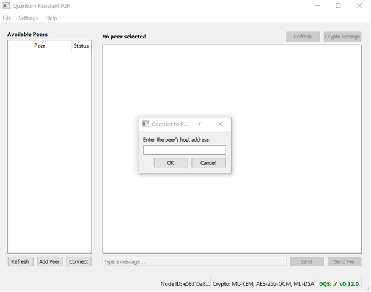
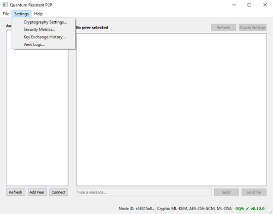

# Quantum Resistant P2P - Uživatelský manuál

## Obsah

1. [Úvod](#úvod)  
2. [Prvotní spuštění](#prvotní-spuštění)  
3. [Hlavní okno programu](#hlavní-okno-programu)  
4. [Záložka File](#záložka-file)  
   - [Connect to Peer](#connect-to-peer)  
   - [Send File](#send-file)  
   - [Change Password](#change-password)  
5. [Záložka Settings](#záložka-settings)  
   - [Cryptography Settings](#cryptography-settings)  
   - [Security Metrics](#security-metrics)  
     - [Algorithms](#algorithms)  
     - [Usage Metrics](#usage-metrics)  
     - [Event Summary](#event-summary)  
   - [Key Exchange History](#key-exchange-history)  
   - [View Logs](#view-logs)  
6. [Příklady scénářů použití](#příklady-scénářů-použití)  
   - [Scénář 1](#scénář-1)  
   - [Scénář 2](#scénář-2)  
   - [Scénář 3](#scénář-3)  
7. [Řešení problémů](#řešení-problémů)  
   - [Nelze nalézt stanici](#nelze-nalézt-stanici)  
   - [Odlišné kryptografické nastavení](#odlišné-kryptografické-nastavení)  
   - [Zapomenuté heslo](#zapomenuté-heslo)  

---

## Úvod

Tento dokument slouží k seznámení uživatele s programem **Quantum Resistant P2P**. Popisuje jeho funkce, nastavení a řešení možných problémů.

## Prvotní spuštění

Po spuštění programu je uživatel vyzván ke zvolení hesla které slouží pro šifrování záznamů které program ukládá. Při dalších spuštěních se stejné heslo používá k jejich dešifrování. 

## Hlavní okno programu

V levé části se nachází seznam dostupných zařízení (peerů) se kterými je možné navázat komunikaci.
Okno v pravé části slouží k zobrazení nastaveného šifrování lokálního počítače a připojeného peera. Pod těmito informace se nachází tlačítka Use Peer Settings a Establish Shared Key.
Tlačítko Use Peer Settings lze použít v případě že jeden z komunikujících počítačů změní nastavení šifrování na svém konci. Po stisknutí tlačítka nastaví daná stanice stejné metody šifrování jako druhý počítač.
Tlačítko Establish Shared Key je nutné stisknout po tlačítku Use Peer Settings aby došlo k výměně klíčů podle nových šifrovacích metod. Komunikace nebude pokračovat dokud nedojde k výměně klíčů.
Pod tlačítky Use Peer Settings a Establish Shared Key se nachází výpis provedených akcí včetně času kdy byly provedeny. Budou se zde zobrazovat odeslané zprávy a soubory.
Ve spodní části je pole určené pro textové zprávy.

## Záložka File

V záložce File se nachází tři položky:
- **Connect to Peer** – ruční zadání IP adresy.
- **Send File** – odeslání souboru.
- **Change Password** – změna hesla pro šifrování logů.

### Connect to Peer

Po zvolení položky Connect to Peer je uživatel vyzván k zadání IP adresy stanice ke které se chce připojit.

### Send File

Položka Send File umožňuje odeslat šifrovanou komunikací soubor. Při zvolení této položky bude otevřen Průzkumník Windows a uživatel bude vyzván k vybrání souboru který bude odeslán. 

### Change Password

Po zvolení této možnosti je uživatel vyzván k zadání původního hesla a nového hesla kterým jej chce nahradit. Při použití této možnosti nedojde ke ztrátě uložených záznamů ani nastavení

## Záložka Settings

Obsahuje:
- **Cryptography Settings** - zde se nastavují algoritmy zabezpečení
- **Security Metrics** - – zde se nachází popisy použitých algoritmů a sledování jejich využití
- **View Logs** - okno s přehledem odeslaných typů zpráv
- **Key Exchange History** - zde se nachází záznamy komunikace včetně nastavení kde může uživatel dešifrovat použité klíče při komunikaci
- 

### Cryptography Settings

V záložce Cryptography Settings se nastavují algoritmy pro výměnu klíčů, Symetrické šifrování a algoritmus pro podpis.

Pro výměnu klíče (Key Exchange) jsou k dispozici následující algoritmy: 

NTRU je Mock only, nefunguje tedy v režimu ochrany proti kvantovým počítačům.

Pro symetrické šifrování (Symmetric Encryption) jsou k dispozici následující algoritmy:

Pro digitální podpis (Digital Signature) jsou k dispozici následující algoritmy:

### Security Metrics

V záložce Security Metrics se nacházejí tři záložky:
-	**Algorithms**
-	**Usage Metrics**
-	**Event Summary**

#### Algorithms

V záložce Algorithms je popsáno současné nastavení algoritmů, počet peerů se kterými jsou sdíleny klíče a detailnější popis právě používaných algoritmů (jméno, úroveň bezpečnosti a krátký popis).

#### Usage Metrics

Eviduje:
Záložka Usage Metrics eviduje aktivitu proběhlou v programu. Konkrétně eviduje:
-	Celkový počet událostí
-	Počet vyměněných klíčů
-	Počet poslaných zpráv
-	Počet přijatých zpráv (z pohledu počítače na které je toto okno otevřeno)
-	Počet přenesených souborů
-	Celková velikost přenesených dat
-	První a poslední aktivita
-	Počet kolikrát byl daný algoritmus použit

#### Event Summary

Event Summary je stručnější verze Usage Metrics a zobrazuje pouze vybrané informace:
-	Inicializace
-	Připojení
-	Výměna klíčů
-	Odeslané zprávy
-	Přijaté zprávy
-	Kolikrát bylo změněno kryptografické nastavení

### Key Exchange History

V této záložce je možné najít historii klíčů a nastavení použitých v konverzaci s ostatními stanicemi. Klíče je možné dešifrovat a zobrazit pomocí tlačítka Decrypt & View Key a zobrazit jej ve formátech Hex, Base64 a jako desítkové hodnoty.

### View Logs

V záložce View Logs se zobrazují typy zpráv které byly odeslány, kdy byly odeslány, kterým počítačem v konverzaci a je připojen stručný popis.
Je možné aktivovat zachytávání zpráv pouze v omezeném časovém období a aplikovat filtry pro jednodušší sledování požadovaných typů zpráv.

Tlačítkem Clear All Logs je možné zachycené události vymazat.

## Příklady scénářů použití

### Scénář 1

**Uživatel chce bezpečně komunikovat s druhým zařízením ve stejné síti.**
Po zapnutí programu dojde k automatické detekci zařízení na síti. Uživatel si vybere se kterým zařízením se chce spojit a dojde k automatické výměně klíčů.

Jakmile je sjednoceno nastavení zabezpečení a potvrzeno spojení sdíleným klíčem uživatel může odesílat textové zprávy a soubory zabezpečeným spojením.

### Scénář 2

**Uživatel chce před zahájením komunikace změnit zabezpečení.**
Na hlavní obrazovce (viz. Hlavní obrazovka) se nachází tlačítko Crypto Settings. Po jeho stisknutí se otevře nabídka kde může uživatel změnit algoritmy použité pro výměnu klíče, symetrické šifrování a digitální podpis.

V případě že jeden z počítačů změnil některý z používaných algoritmů je možné v tomto okně automaticky aplikovat stejné nastavení zvolením daného počítače v nabídce a stisknutím tlačítka Adopt Selected Peer’s Settings.

### Scénář 3

**Uživatel komunikoval s dalším počítačem v síti. Po nějaké době ale druhý uživatel změnil nastavení zabezpečení a došlo k přerušení komunikace.**

Uživateli stačí stisknout tlačítko Use Peer Settings které nastaví stejné algoritmy zabezpečení jako druhá stanice.
Stisknutím tlačítka Establish Shared Key dojde k opětovnému zaslání sdíleného klíče a obnovení komunikace mezi stanicemi.

## Řešení problémů

### Program nebyl schopen nalézt stanici se kterou by se mohl spojit

V této situaci by měl uživatel nejprve zkontrolovat že se zařízení se kterým se chce spojit nachází na stejné síti a je zapnuté.
Pokud je zařízení na stejné síti a zapnuté, uživatel by měl chvíli vyčkat (cca 30 sekund). Zařízení může být během této doby stále nalezeno aniž by uživatel musel provádět další akci.
Pokud ani po této době není zařízení nalezeno, uživatel může ručně přidat druhý počítač (viz. Connect to Peer).

### Kryptografické nastavení stanic se liší

V případě že jeden z uživatelů změní nastavení algoritmů klíče, šifrování nebo podpisu bude komunikace přerušena a druhý uživatel bude upozorněn že došlo ke změně.
V tomto případě je nutné pomocí tlačítka Use Peer Settings sjednotit nastavení bezpečnostních prvků a následně pomocí tlačítka Establish Shared Key opět navázat komunikaci.

### Uživatel zapomněl heslo které použil pro šifrování logů

Může se stát že uživatel zapomněl heslo které nastavil při prvotním spuštění aplikace nebo jej zadal chybně. Bude zobrazeno varování že se nepodařilo přihlásit a uživatel se může pokusit zadat heslo znovu nebo heslo resetovat.

Pokud se uživatel rozhodne resetovat heslo dojde z bezpečnostních důvodů k vymazání zabezpečených logů, historie a stejně tak uložených spojení s jinými stanicemi.

Tuto akci by nemělo být možné provést omylem, je implementováno několik bezpečnostních prvků a uživatel je několikrát varován že přijde o všechna data a rozhodnutí není možné zvrátit.
