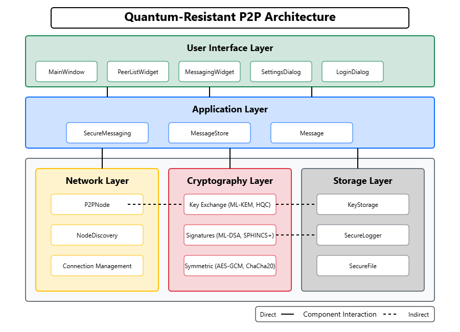
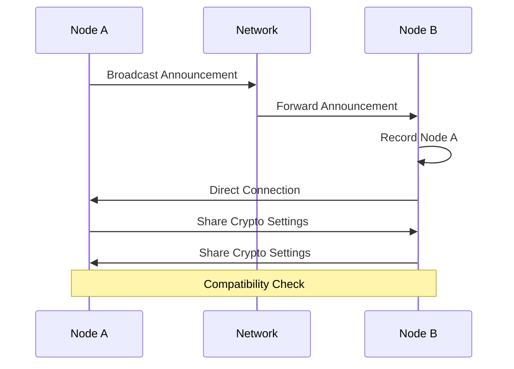
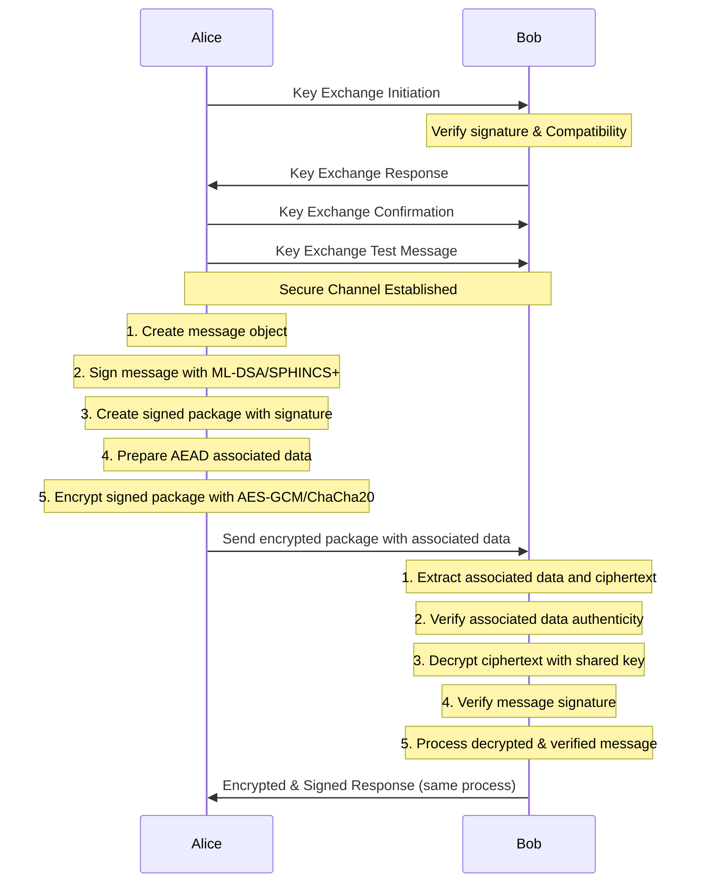

# Quantum-Resistant P2P Architecture Overview

## 1. System Architecture

The Quantum-Resistant P2P application is designed as a secure peer-to-peer communication platform that uses post-quantum cryptographic algorithms to ensure forward security. The system consists of several key components organized in a layered architecture:



### 1.1 Core Components

#### 1.1.1 Networking Layer
- **P2PNode**: Handles direct peer-to-peer connections, message passing, and connection management
- **NodeDiscovery**: Provides mechanisms for discovering other peers on the network via broadcast and direct announcements

#### 1.1.2 Cryptography Layer
- **Key Exchange**: Implements post-quantum key exchange algorithms (ML-KEM, HQC, FrodoKEM)
- **Symmetric Encryption**: Provides authenticated encryption with associated data (AES-256-GCM, ChaCha20Poly1305)
- **Digital Signatures**: Implements post-quantum signature schemes (ML-DSA, SPHINCS+)
- **KeyStorage**: Securely stores cryptographic keys using password-based encryption with Argon2id

#### 1.1.3 Application Layer
- **SecureMessaging**: Coordinates cryptographic operations for secure communication
- **SecureLogger**: Provides encrypted, tamper-evident logging of security events
- **MessageStore**: Stores and manages conversation history with unread message tracking

#### 1.1.4 User Interface Layer
- **MainWindow**: Primary application window with menu and status bar
- **MessagingWidget**: UI for message conversations and file transfers
- **PeerListWidget**: UI for displaying and interacting with peers
- **Settings Dialogs**: Various dialogs for configuring cryptographic settings
- **Security Dialogs**: Key history viewer, log viewer, security metrics dialogs

### 1.2 Component Interactions

The application follows a modular design where components interact through well-defined interfaces:

1. The P2PNode provides the networking foundation, with higher-level components like SecureMessaging built on top
2. The cryptographic algorithms are abstracted through base classes, allowing easy algorithm switching
3. The UI components interact with the application logic through signal/slot connections and async tasks

## 2. Data Flow

### 2.1 Peer Discovery Process



### 2.2 Secure Message Exchange



## 3. Security Architecture

### 3.1 Post-Quantum Security

The application implements several post-quantum algorithms to protect against future quantum computing threats:

- **Lattice-based**: ML-KEM (formerly Kyber) and ML-DSA (formerly Dilithium)
- **Code-based**: HQC key encapsulation
- **Hash-based**: SPHINCS+ signatures
- **Standard LWE**: FrodoKEM

These are complemented by classical strong symmetric encryption:

- AES-256-GCM with AEAD
- ChaCha20-Poly1305 with AEAD

### 3.2 Cryptographic Protocol

The secure communication protocol follows these steps:

1. **Key Exchange**: Establish a shared secret using a post-quantum KEM with ephemeral keypairs
2. **Key Derivation**: Use HKDF to derive symmetric keys from the shared secret
3. **Message Protection**: Implement sign-then-encrypt approach:
   - Create the message with content and metadata
   - Sign the message JSON with sender's private key
   - Create a signed package with message, signature, and public key
   - Create associated data with critical metadata (message ID, sender/recipient IDs, timestamp)
   - Encrypt the signed package using AEAD with the associated data
4. **Message Verification**:
   - Verify the associated data integrity
   - Decrypt the ciphertext using the shared key
   - Verify the signature of the decrypted message
   - Process the verified message

### 3.3 Key Management

- **Ephemeral Keys**: Fresh keypairs generated for each key exchange for forward secrecy
- **Key Storage**: All keys are stored in encrypted form using Argon2id for password-based key derivation
- **Key Rotation**: The application supports re-establishing keys when cryptographic settings change
- **Key History**: Secure view of past key exchanges with on-demand decryption
- **Secure Deletion**: Secure cleanup of sensitive material from memory

### 3.4 Algorithm Parameter Specifics

The application provides different security levels for each post-quantum algorithm:

| Algorithm | NIST Level | Variant | Security Against Classical & Quantum Attackers |
|-----------|------------|---------|----------------------------------------------|
| ML-KEM | 1 | ML-KEM-512 | ~128 bits |
| ML-KEM | 3 | ML-KEM-768 | ~192 bits |
| ML-KEM | 5 | ML-KEM-1024 | ~256 bits |
| HQC | 1 | HQC-128 | ~128 bits |
| HQC | 3 | HQC-192 | ~192 bits | 
| HQC | 5 | HQC-256 | ~256 bits |
| FrodoKEM | 1 | FrodoKEM-640-(AES/SHAKE) | ~128 bits |
| FrodoKEM | 3 | FrodoKEM-976-(AES/SHAKE) | ~192 bits |
| FrodoKEM | 5 | FrodoKEM-1344-(AES/SHAKE) | ~256 bits |
| ML-DSA | 2 | ML-DSA-44 | ~128 bits |
| ML-DSA | 3 | ML-DSA-65 | ~192 bits |
| ML-DSA | 5 | ML-DSA-87 | ~256 bits |
| SPHINCS+ | 1 | SPHINCS+-SHA2-128f-simple | ~128 bits |
| SPHINCS+ | 3 | SPHINCS+-SHA2-192f-simple | ~192 bits |
| SPHINCS+ | 5 | SPHINCS+-SHA2-256f-simple | ~256 bits |

**Note on Symmetric Algorithms:**
- AES-256-GCM: 256-bit keys (providing ~128-bit security against quantum attacks via Grover's algorithm)
- ChaCha20-Poly1305: 256-bit keys (providing ~128-bit security against quantum attacks via Grover's algorithm)

### 3.5 Secure Random Number Generation

The application uses cryptographically secure random number generation for all security-critical operations:

1. **System-Level RNG**: Uses `os.urandom()` which directly accesses the OS entropy source (/dev/urandom on Unix, CryptGenRandom on Windows)
2. **Nonce Generation**: 12-byte (96-bit) random nonces for all AEAD operations
3. **Salt Generation**: 16-byte (128-bit) random salts for key derivation
4. **Algorithm-Specific RNG**: The liboqs library uses its own secure RNG for post-quantum operations
5. **Unique Identifiers**: UUID v4 generation for message IDs using Python's cryptographically secure `uuid.uuid4()`

### 3.6 Forward Secrecy Guarantees

The application implements forward secrecy through several mechanisms:

1. **Ephemeral Keypairs**: Fresh keypairs are generated for each key exchange session
2. **Key Lifecycle Management**:
   - Private keys are deleted immediately after use in key exchange
   - Keys are stored only in memory during active sessions
   - Private key material is explicitly overwritten in memory when no longer needed
3. **Session Independence**: Each connection uses completely independent keying material
4. **Compromise Containment**: If a session key is compromised, it does not affect the security of past or future communications
5. **Re-keying on Settings Change**: When cryptographic settings change, all session keys are regenerated

## 4. Network Protocol

### 4.1 Message Types

The P2P network protocol defines several message types:

| Message Type | Purpose |
|--------------|---------|
| hello | Initial connection establishment |
| hello_response | Response to hello message |
| key_exchange_init | Begin key exchange process |
| key_exchange_response | Response with encapsulated key |
| key_exchange_confirm | Confirmation of successful key establishment |
| key_exchange_test | Test message to verify secure channel |
| key_exchange_rejected | Notification of key exchange rejection with reason |
| secure_message | Encrypted and signed message content |
| crypto_settings_update | Inform peer about cryptographic algorithm changes |
| crypto_settings_request | Request peer's cryptographic settings |

### 4.2 Message Security Model

The application implements a layered security approach for each message:

```
┌─────────────────────────────────────────────────┐
│ Original Message (plaintext or file content)    │
├─────────────────────────────────────────────────┤
│ Digital Signature Layer (ML-DSA or SPHINCS+)    │
│ (Ensures authenticity and integrity)            │
├─────────────────────────────────────────────────┤
│ Symmetric Encryption Layer with AEAD            │
│ (Ensures confidentiality and tamper detection)  │
├─────────────────────────────────────────────────┤
│ Associated Authenticated Data                   │
│ (Ensures metadata integrity)                    │
└─────────────────────────────────────────────────┘
```

### 4.3 AEAD Implementation

The application uses Authenticated Encryption with Associated Data (AEAD) for message protection:

1. **Confidentiality**: The message content is encrypted to protect it from unauthorized readers
2. **Authentication**: The ciphertext includes an authentication tag to detect tampering
3. **Associated Data**: Critical metadata is bound to the ciphertext but not encrypted
4. **Benefits**:
   - Metadata can be used for routing without decryption
   - Changes to either ciphertext or associated data will cause authentication to fail
   - Protection against replay attacks by including message IDs and timestamps

This is implemented using:
- **AES-256-GCM**: Uses a 12-byte random nonce and GCM mode for AEAD
- **ChaCha20-Poly1305**: Uses a 12-byte random nonce and Poly1305 for authentication

### 4.4 Large Message Handling

For large messages (like file transfers), the application uses a chunking mechanism:

1. The sender splits the message into chunks of configurable size (default 64KB)
2. Header includes:
   - Flags byte indicating chunking
   - UUID for message identification
   - Total chunks count and size
   - Individual chunk index and size
3. The receiver reassembles the chunks into the complete message
4. Error handling for incomplete transmissions

### 4.5 Peer Identity Verification

The application implements a multi-layered approach to peer identity verification:

1. **Persistent Node Identifiers**: Each node has a unique ID persisted across sessions
2. **Signed Key Exchange**: All key exchange messages are signed using post-quantum signatures
3. **Identity Binding**: The key exchange protocol explicitly binds:
   - Sender and recipient IDs
   - Timestamps to prevent replay attacks
   - Message IDs for uniqueness verification
4. **Verification Checks**:
   - Sender/recipient ID validation on every message
   - Signature verification on all key material
   - Timestamp validation (5-minute window) to prevent replays
5. **Visual Verification**: The UI displays truncated peer IDs (first 8 characters) for visual verification
6. **Connection Metadata**: Peers share algorithm preferences which must remain consistent during a session

This implementation does not provide full protection against man-in-the-middle attacks on initial connection without additional out-of-band verification.

## 5. Secure Storage Architecture

The secure storage layer provides comprehensive protection for sensitive data at rest through several integrated components:

### 5.1 KeyStorage

Provides encrypted storage for cryptographic keys with strong security properties:

- **Password-Based Encryption**: Uses Argon2id key derivation (100MB memory, parallelism 4) for master key generation
- **Complete Encryption**: All keys and metadata are encrypted, with no plaintext information in stored files
- **Key Hierarchy**: Derives purpose-specific keys from the master key for domain separation
- **Metadata Protection**: Uses HMAC-based key identifiers to prevent information leakage
- **Emergency Recovery**: Supports password reset with secure data erasure when needed

### 5.2 SecureLogger

Implements encrypted, tamper-evident logging for security events:

- **Encrypted Log Entries**: Each log entry is individually encrypted and authenticated
- **Corruption Recovery**: Self-healing mechanisms to recover from partially corrupted log files
- **Structured Organization**: Daily log rotation with separate encryption per file
- **Security Metrics**: Aggregates usage patterns and security-relevant statistics

### 5.3 SecureFile

Provides robust, corruption-resistant file operations:

- **Atomic Updates**: Ensures files are either completely updated or unchanged
- **Concurrency Control**: Two-level locking for multi-process/thread safety
- **Automatic Backups**: Creates backups of critical files before modification
- **Cross-Platform**: Adapts to platform-specific filesystem behaviors

### 5.4 Secure Data Flow

The secure storage components work together to protect sensitive data throughout its lifecycle:

1. **Authentication**: User password unlocks the KeyStorage via Argon2id KDF
2. **Key Protection**: All cryptographic keys are protected under the master key
3. **Secure Logging**: Security events are encrypted and logged with tamper protection
4. **Message Persistence**: Messages are stored with sender verification and unread tracking
5. **Safe Operations**: All file operations use atomic updates with backup creation

## 6. Extensibility

The architecture is designed for extensibility:

- **Algorithm Abstraction**: New cryptographic algorithms can be added by implementing the abstract base classes
- **Protocol Extensions**: The messaging protocol can be extended with new message types
- **UI Customization**: The modular UI design allows for components to be replaced or enhanced
- **Crypto Settings Adoption**: Peers can adopt compatible settings from each other

## 7. Security Auditing

The system includes comprehensive security logging and metrics:

- **SecureLogger**: Encrypts all security events with tamper detection
- **Event Tracking**: Records key exchanges, message transfers, and security settings changes
- **Security Metrics**: Tracks algorithm usage, connection statistics, and security levels
- **Corruption Protection**: Log files have recovery mechanisms for corruption resistance

## 8. Password Management

The application includes robust password management features:

- **Secure Login**: Password-based unlocking of the key storage using Argon2id KDF
- **Password Change**: Ability to change the storage password
- **Password Reset**: Emergency reset capability with complete data erasure
- **Security Strength**: Password quality recommendations

## 9. Deployment Architecture

The application is designed as a standalone desktop application that can operate in various network environments:

- **Local Networks**: Direct peer connections on LANs
- **Internet**: Direct connections over the internet (may require port forwarding)
- **Mixed Environments**: Discovery works on local networks while direct connections can span networks

No central servers are required for operation, maintaining the true peer-to-peer nature of the system.
