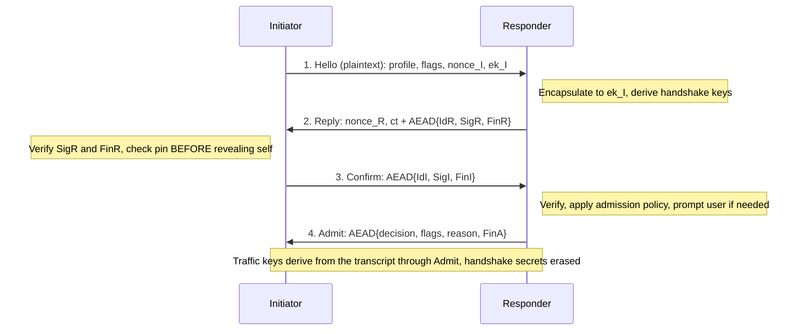
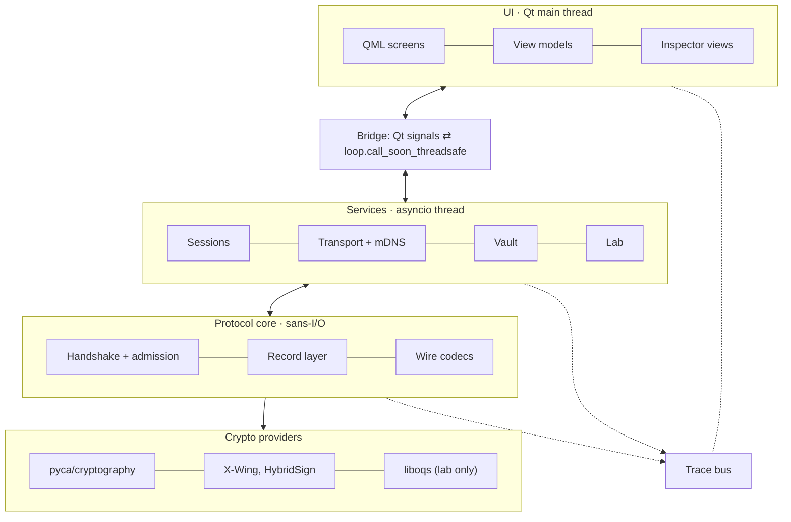

# QRP2P v2 — Design Specification

| | |
| --- | --- |
| Version | 1.4 |
| Date | 2026-10-02 |
| Status | Approved for implementation |
| Scope | Complete rewrite of `quantum-resistant-p2p` (v1) |

QRP2P v2 is a desktop messenger for two people on the same local network. Its channel is authenticated, forward-secret and hybrid post-quantum. Its purpose is to let learners **watch, pause and attack that exact channel**. The learning layer is the product's differentiator; the secure core is what makes it honest.

---

## Contents

1. [Conventions](#1-conventions)
2. [Goals, scope and principles](#2-goals-scope-and-principles)
3. [Threat model and security properties](#3-threat-model-and-security-properties)
4. [Cryptographic profiles](#4-cryptographic-profiles)
5. [Identity and trust](#5-identity-and-trust)
6. [Discovery and transport](#6-discovery-and-transport)
7. [Handshake](#7-handshake)
8. [Record layer](#8-record-layer)
9. [File transfer](#9-file-transfer)
10. [Local storage (vault)](#10-local-storage-vault)
11. [Learning layer](#11-learning-layer)
12. [Architecture](#12-architecture)
13. [Technology stack and packaging](#13-technology-stack-and-packaging)
14. [User interface](#14-user-interface)
15. [Verification and testing](#15-verification-and-testing)
16. [Roadmap](#16-roadmap)
17. [Risks and known limits](#17-risks-and-known-limits)
18. [Product decisions](#18-product-decisions)
19. [References](#19-references)
- [Appendix A — Profile constants and message sizes](#appendix-a--profile-constants-and-message-sizes)
- [Appendix B — Codes](#appendix-b--codes)
- [Appendix C — Glossary](#appendix-c--glossary)

---

## 1. Conventions

- **MUST**, **MUST NOT**, **SHOULD** and **MAY** are used as in RFC 2119.
- All integers are unsigned and **big-endian**: `u8`, `u16`, `u32`, `u64`.
- `a ‖ b` is byte concatenation. `0^n` is *n* zero bytes. `opaque[n]` is exactly *n* bytes.
- `H` is the profile's hash, `Hlen` its output length, and `HMAC-H` / `HKDF-*` are the RFC 2104 / RFC 5869 constructions over `H`.
- String literals are ASCII bytes without a terminator. `"qrp2p2 "` (with a trailing space) is the protocol's label prefix.
- *Initiator* (I) opens the TCP connection. *Responder* (R) accepts it.
- Sizes are exact unless marked "≈".

---

## 2. Goals, scope and principles

### 2.1 Goals

1. **A real secure core.** Mutually authenticated, forward-secret, replay-proof and hybrid post-quantum. A normal session gives up nothing because the learning features exist.
2. **The learning layer is the product.** Every protocol step can be observed. Secrets are shown only in sessions both users agreed to. Attacks run against the real code, not a simulation.
3. **A modern desktop app.** Fast, polished, one installer per OS.

### 2.2 Scope

| Decision | Choice |
| --- | --- |
| Language | Python 3.14+ |
| Network | LAN only; discovery via mDNS; manual connect by address |
| Conversations | Two parties per session; many contacts, each a 1:1 channel |
| History | Kept on disk, encrypted |
| Platforms | Desktop: Windows, macOS, Linux |
| UI and lessons | English |
| Licence | MIT |

### 2.3 Non-goals

Internet use and NAT traversal; group chats; mobile; hiding who talks to whom (traffic analysis); protection once a device is compromised persistently; production certification.

### 2.4 Design principles

1. **Don't invent crypto.** NIST-standard primitives (FIPS 203/204), a published combiner (X-Wing), a handshake shaped like TLS 1.3. The only custom construction is the handshake composition, and it is formally modelled before it is coded.
2. **One engine, many views.** The inspector observes the real protocol engine; there is no parallel teaching implementation.
3. **Secrets need mutual consent.** Exposure is decided per session, after authentication, and labelled permanently on both screens.
4. **Every attack demo is also a regression test.**
5. **Exact bytes.** Everything that is hashed or signed has a fixed binary layout.
6. **Fail closed and loudly.** Every failure has a named reason. No silent fallback, no swallowed error, no retry on the same keys.

---

## 3. Threat model and security properties

### 3.1 Attackers

| Attacker | Capabilities | Main defence |
| --- | --- | --- |
| **A1 LAN attacker** | Read, drop, modify, inject, replay and reorder any packet; spoof mDNS and ARP; run their own nodes; send Hellos to anyone | Pinned identity bundles, the authenticated four-message handshake, AEAD records with implicit counters |
| **A2 Malicious peer** | An admitted contact sending malformed, oversized or deceptive data | Fixed-layout parsing, strict schemas, size caps, sender derived from the session (never from payload fields), no rich-text rendering of peer data |
| **A3 Harvest now, decrypt later** | Record traffic today; run a cryptographically relevant quantum computer later | Hybrid KEM; ephemeral keys; no session secrets stored |
| **A4 Offline device thief** | Copy the data directory and its backups; no password | Argon2id-derived vault key, column encryption, per-conversation keys destroyed on delete |
| **A5 Transient state compromise** | Learns one live session's current secrets once (memory read, debugger, a lab "leak"); may remain active on the network afterwards | Erase-after-use ratchets; periodic PQ rekey signed with identity keys |

### 3.2 Security properties

| ID | Property |
| --- | --- |
| **P1** | *Confidentiality* of messages and files against A1 and A3. |
| **P2** | *Mutual authentication.* Each side proves possession of an identity bundle. The initiator checks the responder's pin **before** revealing its own identity. P2 holds automatically for pinned contacts; for a first contact it holds once the users compare safety numbers. |
| **P3** | *Forward secrecy.* Later theft of identity keys exposes no past session traffic captured on the network. (Stored history is covered by P7: a stolen vault **plus** its password reveals kept messages by design.) |
| **P4** | *Integrity and ordering.* Every record is authenticated, delivered in order and at most once per session. Tampering, replay or reordering terminates the session. |
| **P5** | *Downgrade resistance.* Profile, glass-box request and admission decision are inside the authenticated transcript. |
| **P6** | *Bounded resources.* Before authentication a peer can make the responder hold at most one bounded frame and one half-open slot, both globally capped. Malformed input never crashes the app. |
| **P7** | *At-rest confidentiality* against A4, with the leakage listed in §10.5. |
| **P8** | *Consent transparency.* A session reveals secrets only if the responder's user admitted it as glass-box after seeing the authenticated initiator, and both sides display the fact. |
| **P9** | *Post-compromise recovery* against A5. A passive A5 is locked out after the next PQ rekey; an active A5 too, provided identity keys were not compromised. |

### 3.3 Identity exposure

Identities are **not** hidden. Anyone who sends a Hello receives the responder's identity bundle and a signature over a transcript they chose. mDNS announces presence (§6.1). The initiator's identity is revealed only to a responder that has already proven the pinned identity. Handshake signatures make participation provable to third parties; lesson 8 teaches this.

### 3.4 Out of scope

Persistent malware or memory access on the device; host side channels; traffic analysis (who, when, message sizes); flooding the LAN; rollback or deletion of rows on a disk the attacker can modify.

### 3.5 Honest limits

Python cannot reliably wipe memory; "erase" means dropping every reference so the object can be freed. Authentication against a quantum attacker only needs to hold during a handshake, and the hybrid signature provides it.

---

## 4. Cryptographic profiles

A **profile** fixes every algorithm of a session. There is no per-algorithm negotiation.

| Profile | ID | KEM | Identity signature | AEAD | Hash / KDF | Where |
| --- | --- | --- | --- | --- | --- | --- |
| `HYBRID-1` (default) | `0x01` | X-Wing (ML-KEM-768 + X25519) | Ed25519 **and** ML-DSA-65 | ChaCha20-Poly1305 | SHA-256 / HKDF-SHA-256 | Normal sessions |
| `PQ-CNSA-1` | `0x02` | ML-KEM-1024 | ML-DSA-87 | AES-256-GCM | SHA-384 / HKDF-SHA-384 | Per-contact option; CNSA 2.0 parameter sets |
| `LAB-CLASSICAL` | `0x7F` | X25519-KEM (below) | Ed25519 | ChaCha20-Poly1305 | SHA-256 / HKDF-SHA-256 | Solo lab only; MUST be refused in normal sessions |

Lab-only algorithms (HQC, FrodoKEM, Classic McEliece, SLH-DSA) appear only in the Algorithm Lab (§11.9) and never protect a session.

`LAB-CLASSICAL` is implemented in `qrp2p/lab/`, not in `qrp2p/core/`. Each profile object carries its KEM and signature scheme, and a crypto provider serves only the profiles it was constructed with; real sessions construct it with `HYBRID-1` and `PQ-CNSA-1` only, so they cannot reach `LAB-CLASSICAL` even if handed its ID.

### 4.1 Rationale

- **Hybrid by default.** A hybrid KEM stays secure while *either* component holds. It is the direction of the field: hybrid ML-KEM groups are standardised for TLS 1.3 (RFC 10024) and are defaults in major browsers, OpenSSL 3.5+ and OpenSSH 10.0. Germany's BSI requires hybrid and France's ANSSI strongly recommends it.
- **A PQ-only profile too.** NSA's CNSA 2.0 accepts pure ML-KEM-1024 and ML-DSA-87. Offering both lets learners measure the difference.
- **ChaCha20-Poly1305** is constant-time in software on every CPU. The CNSA profile uses AES-256-GCM because CNSA 2.0 requires it.

### 4.2 X-Wing

X-Wing follows `draft-connolly-cfrg-xwing-kem`. It is implemented from `pyca/cryptography` primitives:

```text
expand(sk[32]):  e = SHAKE256(sk, 96)
                 skM = ML-KEM-768.from_seed(e[0:64])        # 64-byte d‖z seed
                 skX = e[64:96];  pkX = X25519(skX, base)
                 pk  = pkM[1184] ‖ pkX[32]                  # 1,216 B
Encaps(pk):      (ssM, ctM) = ML-KEM-768.Encaps(pk[0:1184])
                 eX random;  ctX = X25519(eX, base);  ssX = X25519(eX, pk[1184:1216])
                 ss = SHA3-256(ssM ‖ ssX ‖ ctX ‖ pkX ‖ 0x5c2e2f2f5e5c);  ct = ctM[1088] ‖ ctX[32]
Decaps(sk, ct):  ssM = ML-KEM-768.Decaps(skM, ct[0:1088]);  ssX = X25519(skX, ct[1088:1120])
                 ss = SHA3-256(ssM ‖ ssX ‖ ct[1088:1120] ‖ pkX ‖ 0x5c2e2f2f5e5c)
```

Requirements:

- The implementation MUST pass the draft's official test vectors (keygen and decapsulation).
- It MUST pass a two-way differential test against pyca's HPKE KEM `MLKEM768_X25519`, which implements X-Wing.
- ML-KEM public keys MUST be validated on import (FIPS 203 modulus check). pyca performs this check but reports a misleading "wrong length" error; the wrapper maps it to `invalid_kem_key`.
- A low-order or all-zero X25519 result raises in pyca. It MUST map to the handshake failure `kem_failure`, never to an unhandled exception.

### 4.3 X25519-KEM (`LAB-CLASSICAL` only)

`ek = pkX`; `ct = ctX` (ephemeral public key); `ss = SHA-256(ssX ‖ ctX ‖ pkX ‖ "qrp2p2 x25519kem")`.

### 4.4 Hybrid signature

`HybridSign(role, th)` for `HYBRID-1`:

```text
ed_msg = "qrp2p2 " ‖ role ‖ 0x00 ‖ th
sig    = Ed25519.Sign(sk_ed, ed_msg)[64] ‖ ML-DSA-65.Sign(sk_ml65, th, context = "qrp2p2 " ‖ role)[3309]
```

Verification MUST check both halves; failure of either is `signature_invalid`. `PQ-CNSA-1` uses ML-DSA-87 alone with the same context string. `LAB-CLASSICAL` uses the Ed25519 half alone.

Roles: `responder`, `initiator`, `rekey-answer`, `rekey-finish`. Because roles are distinct, a signature can never be replayed across roles or protocols. ML-DSA signing in pyca is hedged (randomised), so signatures are not reproducible (see §11.6).

---

## 5. Identity and trust

### 5.1 Identity bundle

One bundle per installation, shared by all profiles, so changing a contact's profile never resets trust.

```text
IdentityBundle = version:u8 (=0x01) ‖ ed25519_pk[32] ‖ mldsa65_pk[1952] ‖ mldsa87_pk[2592]     # 4,577 B
peer_id        = SHA-384("qrp2p2 identity" ‖ IdentityBundle)                                  # 48 B, over the exact bytes
short_id       = Base32(peer_id[0:5])  →  8 characters, shown as XXXX-XXXX
```

Private keys are stored as seeds in the vault (§10): Ed25519 32 B, ML-DSA 32 B each.

### 5.2 Safety number

```text
digits(p) = for i in 0..5:  u40(SHAKE256("qrp2p2 safety" ‖ peer_id_p, 30)[5i : 5i+5]) mod 100000, as 5 digits
safety    = digits(lower peer_id) ‖ digits(higher peer_id)        # 60 digits, 12 groups of 5, same on both screens
```

A MITM on a first contact is exposed because each victim sees a different pair of IDs. Each half carries about 100 bits, so it cannot be ground to a match.

### 5.3 Trust states

| State | Entered when | Effect |
| --- | --- | --- |
| **Unknown** | A bundle is seen that matches no contact | Admission prompts a contact request |
| **Pinned** | The user accepts a first session | Connects automatically; grey shield "not verified" |
| **Verified** | The user confirms the safety number out of band | Green shield; may enable file auto-accept |
| **Blocked** | The user blocks the contact | Admission rejects silently with `declined` |

A **key mismatch** is an *event*, not a state. It is raised only on the **initiator** side, when the user connects to a chosen contact and the responder proves a different bundle. The initiator aborts before sending Confirm and shows the mismatch page: old and new fingerprints, an explanation of MITM, and **Cancel** or **Re-pin**.

Rules:

1. Display names, mDNS records and addresses are hints only; only a proven bundle identifies a peer.
2. On the responder side an unknown bundle is always a new contact request, never a key-change alarm, so attackers cannot aim the red screen at a real contact.
3. **Re-pin** replaces the contact's bundle, sets the state to Pinned (never Verified), turns file auto-accept off, inserts a visible "identity changed" marker into the history, and recommends a safety-number check.
4. Identity rotation (the new bundle signed by the old) is reserved for v2.1 via the version byte.

---

## 6. Discovery and transport

### 6.1 mDNS

- Service type `_qrp2p._tcp.local.`; instance name `"<display name or QRP2P> (<short_id>)"`.
- TXT record: `v=2`, `id=<hex of peer_id[0:8]>`, `pf=<hex bitmask of supported profiles: bit0 HYBRID-1, bit1 PQ-CNSA-1>`.
- Showing the display name is a setting (on by default). All mDNS data is an unauthenticated hint.
- Announcements stop while the app is locked.
- Records are parsed strictly: `v` must be `2`, `id` exactly 16 hex digits, `pf` one or two hex digits; anything else is ignored, as is our own record. A peer's addresses are ranked for dialling and at most 8 are kept (§6.2). Instance names are displayed as plain text with control and bidirectional characters replaced (§14.3); a dot in the display name is replaced by U+2024 so it cannot split the DNS name, which is cut to one 63-byte label.
- Only non-loopback, non-link-local addresses are announced. mDNS itself runs on every interface except loopback.

### 6.2 Transport

- TCP over IPv4 and IPv6. Default port **47470** (configurable); if busy, the next free port (up to 16 are tried), announced via mDNS.
- Manual connect by `host:port` is always available.
- **Dialling.** A peer announces every interface it has, including Docker bridges and VPNs that the dialler cannot reach, and each costs a 5 s connect timeout. So addresses are tried one at a time in this order: a contact's last working address; then announced addresses on a subnet the dialler shares; then the other announced addresses; then announced addresses that are the dialler's own (a second node on this machine). The dialler drops its own addresses at its own port (Docker gives many machines `172.17.0.1`; dialling it reaches ourselves), and loopback, unspecified and multicast addresses. If the contact connects to us while we dial, the dial ends as a success. A dial that reaches no address says a firewall may be the cause.
- One TCP connection per session.

### 6.3 Framing

```text
frame = length:u32 ‖ type:u8 ‖ body[length]
```

| Type | Name | Body |
| --- | --- | --- |
| `0x10` | Hello | plaintext (§7.2) |
| `0x11` | Reply | plaintext part + AEAD part |
| `0x12` | Confirm | AEAD |
| `0x13` | Admit | AEAD |
| `0x1F` | ProfileUnsupported | `supported:u8` bitmask (plaintext hint) |
| `0x20` | Record | AEAD (§8) |

- `length` MUST be checked **before** allocation. Maximum body: 16,448 B.
- Handshake bodies MUST have the exact size for the profile (Appendix A); any other size is `oversize` or `schema_error`.
- The stream reader's buffer limit equals the maximum frame.

### 6.4 Resource limits

| Limit | Value |
| --- | --- |
| Half-open handshakes (global / per source address) | 32 / 4 |
| Hello rate (global token bucket) | 20 per second, burst 40 |
| Handshake crypto deadline (Hello → Confirm received) | 10 s |
| Initiator's wait for Admit after sending Confirm | 70 s (admission deadline + 10 s) |
| Admission deadline (user prompt) | 60 s |
| Live sessions | 64 |
| Responder state per half-open slot | ≈ 15 KB (transcript + handshake secrets) |
| Idle timeout | 90 s without any record |
| Write stall (the peer stops reading) | 90 s, then the session ends with `timeout` |
| Writer backlog per session | 4,096 queued messages, then `close { rate_limited }` |
| Pending file offers per contact | 3 |

Each Hello costs the responder one encapsulation and one hybrid signature, about 1.5 ms on a modern laptop, so these limits also bound CPU use.

Enforcement:

- A half-open slot is taken when TCP accepts the connection and released when the session is established or ends; a connection that finds no slot is dropped at once. The handshake deadline (from accept) frees slots held by silent peers.
- The Hello token bucket is consulted when a connection's first frame arrives, before any cryptography; an empty bucket drops the connection.
- Refusals before authentication are silent (§8.5): the peer sees the connection drop; the node logs `rate_limited`.
- The live-session cap is applied at admission: beyond 64, a peer without a session to replace is rejected with `busy`.
- The writer backlog bounds what a peer can make us queue by sending faster than it reads (pings to answer, chats to acknowledge).

---

## 7. Handshake

### 7.1 Overview



Messages 1–3 follow the SIGMA-I "sign-and-MAC" pattern as used by TLS 1.3. **Admit** exists because the responder cannot decide anything about a contact (consent, pin policy, per-contact profile) until message 3 authenticates who is asking.

### 7.2 Message layouts

Lengths per profile are in Appendix A. `aead_part` is the profile AEAD with `Keys(secret)` (§7.4), nonce = `iv XOR u96(seq)`, and AAD = the 5-byte frame header (`length ‖ type`).

```text
Hello    = version:u8 (=0x02) ‖ profile:u8 ‖ flags:u8 ‖ nonce_I[32] ‖ ek_I[ek_len]
           flags: bit0 = gb_request; all other bits MUST be 0
Reply    = nonce_R[32] ‖ ct[ct_len] ‖ AEAD(Keys(hs_R), seq=0, ReplyInner)
ReplyInner   = IdR[4577] ‖ SigR[sig_len] ‖ FinR[Hlen]
Confirm  = AEAD(Keys(hs_I), seq=0, ConfirmInner)
ConfirmInner = IdI[4577] ‖ SigI[sig_len] ‖ FinI[Hlen]
Admit    = AEAD(Keys(hs_R), seq=1, AdmitInner)
AdmitInner   = AdmitBody ‖ FinA[Hlen]
AdmitBody    = decision:u8 (0 accept, 1 reject) ‖ flags:u8 (bit0 = glass_box) ‖ reason:u8 (Appendix B)
```

An unknown `version` or non-zero reserved flag bits MUST close the connection silently (`schema_error`). A `profile` the responder does not serve is answered with `ProfileUnsupported` and the connection closed (§7.5). An accept carries reason `none`; a reject carries any other reason and `glass_box = 0`; any other AdmitBody, an unknown decision or reason, or a reserved flag bit is `schema_error`.

### 7.3 Transcript

The transcript `TR` is built from tagged entries over exact plaintext bytes:

```text
T(tag, value) = tag:u8 ‖ u32(len(value)) ‖ value
```

| Tag | Value |
| --- | --- |
| `0x10` | Hello body |
| `0x11` | `nonce_R ‖ ct` |
| `0x21`, `0x22`, `0x23` | IdR, SigR, FinR |
| `0x31`, `0x32`, `0x33` | IdI, SigI, FinI |
| `0x41`, `0x42` | AdmitBody, FinA |

### 7.4 Key schedule

```text
HkdfLabel(L, label, ctx)       = u16(L) ‖ u8(len("qrp2p2 " ‖ label)) ‖ "qrp2p2 " ‖ label ‖ u8(len(ctx)) ‖ ctx
Expand-Label(S, label, ctx, L) = HKDF-Expand(S, HkdfLabel(L, label, ctx), L)
Derive-Secret(S, label, th)    = Expand-Label(S, label, th, Hlen)
Keys(S)                        = key = Expand-Label(S, "key", "", 32),  iv = Expand-Label(S, "iv", "", 12)

hs            = HKDF-Extract(salt = 0^Hlen, ikm = ss)
TR            = T(0x10, Hello) ‖ T(0x11, nonce_R ‖ ct);           th_hello = H(TR)
hs_R, hs_I    = Derive-Secret(hs, "r hs traffic" | "i hs traffic", th_hello)
fk_R, fk_I    = Expand-Label(hs_R | hs_I, "finished", "", Hlen)

TR ‖= T(0x21, IdR);                   SigR = HybridSign("responder", H(TR))
TR ‖= T(0x22, SigR);                  FinR = HMAC-H(fk_R, H(TR))
TR ‖= T(0x23, FinR) ‖ T(0x31, IdI);   SigI = HybridSign("initiator", H(TR))
TR ‖= T(0x32, SigI);                  FinI = HMAC-H(fk_I, H(TR))
TR ‖= T(0x33, FinI) ‖ T(0x41, AdmitBody);  FinA = HMAC-H(fk_R, H(TR))
TR ‖= T(0x42, FinA);                  th_final = H(TR)

cs_0          = HKDF-Extract(salt = Derive-Secret(hs, "derived", H("")), ikm = 0^Hlen)     # chaining secret, epoch 0
ap_I, ap_R    = Derive-Secret(cs_0, "i ap traffic" | "r ap traffic", th_final)
exporter_0    = Derive-Secret(cs_0, "exporter", th_final)
erase: ss, hs, hs_R, hs_I, fk_R, fk_I, the ephemeral KEM private key
```

- Finished values MUST be compared in constant time.
- The chaining secret `cs` is where each PQ rekey injects fresh key material (§8.4).
- `exporter_n` is used only to bind rekeys, and in glass-box sessions as a displayed session fingerprint.

### 7.5 Processing rules

**Initiator, on Reply:**

1. Decapsulate `ct` and derive the handshake secrets.
2. Decrypt ReplyInner; failure is `decrypt_failed`.
3. Verify SigR, then FinR.
4. If the user chose a contact, IdR MUST equal the pinned bundle; otherwise raise the key-mismatch event and close without sending Confirm. If the peer came from discovery or manual connect with no contact, continue as a first contact.
5. Reject IdR if it equals our own bundle (`reflection`).

**Responder, on Hello:** check sizes, version and profile support; `LAB-CLASSICAL` is accepted only by solo-lab nodes. On an unsupported profile, reply with `ProfileUnsupported` and close. Reject an `ek_I` equal to any of our own outstanding ephemeral keys (`reflection`). Then encapsulate, sign and send Reply.

**Responder, on Confirm:** decrypt, verify SigI and FinI, reject our own bundle, then run admission (§7.6). Only after that send Admit.

**Initiator, on Admit:** decrypt, verify FinA. On `reject`, show the named reason. On `accept`, derive the traffic keys and open the session. `glass_box` in Admit MUST be 0 if `gb_request` was 0; otherwise close with `policy`.

**Key confirmation.** The responder has no fifth handshake message. Its agreement with the initiator on `th_final` (and so on the admission decision) is established by the first record it opens under `ap_I`. The formal model proves exactly this (`formal/handshake.pv`).

### 7.6 Admission policy (responder)

| Initiator's bundle | `gb_request` | Outcome |
| --- | --- | --- |
| Blocked | any | reject `declined`, no prompt |
| Unknown | 0 | Contact-request prompt; accept pins the contact |
| Unknown | 1 | Contact-request prompt; glass-box refused (`glass_box = 0`) with an explanation |
| Pinned / Verified | any | First: reject `profile_policy` unless the Hello profile equals the contact's configured profile |
| Pinned / Verified | 0 | Accept automatically |
| Pinned / Verified | 1 | Glass-box consent prompt naming the authenticated contact; accept gives `glass_box = 1`, decline gives a normal session |

- Prompts are bounded by the admission deadline; expiry gives reject `timeout`.
- Accepting a contact request pins the initiator's bundle with the Hello's profile as the contact's profile.
- The initiator shows "waiting for <contact>".
- Glass-box prompts are rate-limited to one per contact per minute and muted for one hour after three declines in a row (an accept resets the count). While a contact's prompts are rate-limited or muted, a glass-box request is admitted as a normal session without a prompt.
- These rules run after the `busy` checks of §7.8 and §6.4.

### 7.7 Profile selection

The initiator offers the chosen contact's profile (default `HYBRID-1`). `ProfileUnsupported` is an unauthenticated hint: the initiator displays it but MUST NOT change the contact's setting because of it. Per-contact enforcement happens at admission, where it is authenticated.

### 7.8 Concurrent sessions

- One live session per contact; a newly established session replaces the previous one, which closes with `replaced`.
- **Simultaneous open:** if both peers connect to each other at once, the session initiated by the lower `peer_id` (byte order) survives. The responder rejects the other with `busy` at admission.
- "At once" means the two handshakes overlap in time. When a responder reaches admission for peer P, it checks whether it has itself initiated a handshake to P (by pin, or by the bundle proven in Reply) that is still in progress, or that was established after this incoming Hello arrived. If so, and our `peer_id` is the lower one, the incoming session is rejected with `busy`; otherwise admission proceeds, and P rejects our handshake by the same rule.
- The same rule applies again when a session is established while another with the same peer is live: if the new handshake began before the live session was established, the two overlapped, and the session opened by the lower `peer_id` survives (the other closes with `replaced`). This covers what admission cannot see, such as an initiator's handshake still waiting for Reply. Only without overlap does the newer session replace the older one (a peer that restarted and reconnected). With symmetric network delays both ends reach the same verdict; a disagreement needs the two establishments to fall within one network delay of each other and asymmetric delays, and can close both sessions, after which the next connect succeeds.
- A session that lost a simultaneous open is not reported as a failure or a disconnect.

---

## 8. Record layer

### 8.1 Records

```text
Record body = AEAD(Keys(ap_dir).key, nonce = Keys(ap_dir).iv XOR u96(seq_dir), aad = frame header, plaintext)
```

- `seq_dir` is a 64-bit counter per direction. It starts at 0 for every new traffic secret and is never transmitted. The receiver's own counter decides, so replay or reordering fails decryption (`decrypt_failed`).
- Plaintext is at most 16,384 B, including the Inner encoding, so a record body is at most 16,400 B; a longer one is `oversize`, a shorter than 16 B one `decrypt_failed`.

### 8.2 Inner messages

Inner is MessagePack encoded with `msgspec` as a tagged union (tag field `kind`, values as in the table), decoded with a strict schema. Unknown tags, extra fields, wrong types or limit violations give `schema_error`. Byte limits on text fields count UTF-8 bytes; `u64` fields reject values above 2^64 − 1; the exact rekey sizes are checked by the record layer against the session's profile. Inner is never hashed or signed, so MessagePack's non-canonical encoding is harmless here.

| Kind | Fields | Limits |
| --- | --- | --- |
| `chat` | `id[16]`, `text` | text ≤ 16,000 B UTF-8 |
| `receipt` | `id[16]` | |
| `file_offer` | `file_id[16]`, `name`, `size:u64`, `media_type` | name ≤ 255 B, media type ≤ 127 B |
| `file_accept`, `file_decline` | `file_id[16]` | |
| `file_chunk` | `file_id[16]`, `data` | data ≤ 16,000 B |
| `file_progress` | `file_id[16]`, `received:u64` | |
| `file_done` | `file_id[16]`, `sha256[32]` | |
| `file_cancel` | `file_id[16]`, `reason:u8` | |
| `key_update` | — | |
| `rekey_offer` | `ek` | exact per profile |
| `rekey_answer` | `ct`, `sig` | exact per profile |
| `rekey_finish` | `sig` | exact per profile |
| `rekey_switch` | — | |
| `ping`, `pong` | — | |
| `close` | `reason:u8` | Appendix B |

The sender of a message is always the session's peer. No Inner field can claim a sender or mark a message as a system message.

### 8.3 Writer rules

- Each connection has exactly one writer task draining a priority queue: control > chat > file data.
- Sequence numbers are assigned and encryption is performed **at dequeue**, never at enqueue.
- Frames never interleave.

### 8.4 Key evolution

**KeyUpdate** (per direction, as in TLS 1.3):

```text
ap_dir' = Expand-Label(ap_dir, "traffic upd", "", Hlen);  keys = Keys(ap_dir');  seq_dir = 0;  erase ap_dir
```

The sender sends `key_update` as its last record under the old secret, then switches. The receiver switches on receipt. Triggers: every 2^16 records or 10 minutes per direction. Stealing a current secret gives later secrets of the same epoch, but never earlier ones.

**PQ rekey** (every 60 minutes, or the user's "Rekey now"):

1. Only the session initiator starts a rekey; at most one per minute. Extra `rekey_offer` messages give `unexpected_message`: one while a rekey is in progress, one sent by the session responder, or one within 30 s of the previous offer (half the initiator's limit, so network delay cannot make an honest initiator look too fast).
2. `rekey_offer { ek' }` from I, then `rekey_answer { ct', SigR' }` from R, then `rekey_finish { SigI' }` from I:

   ```text
   RT    = T(0x51, ek') ‖ T(0x52, ct')
   SigR' = HybridSign("rekey-answer", H(RT ‖ exporter_n))
   SigI' = HybridSign("rekey-finish", H(RT ‖ T(0x53, SigR') ‖ exporter_n))
   th_rekey = H(RT ‖ T(0x53, SigR') ‖ T(0x54, SigI'))
   ```
3. Both sides derive, then erase `cs_n`, `ss'` and the ephemeral key:

   ```text
   cs_{n+1}   = HKDF-Extract(salt = Derive-Secret(cs_n, "derived", H("")), ikm = ss')
   ap_I, ap_R = Derive-Secret(cs_{n+1}, "i ap traffic" | "r ap traffic", th_rekey)
   exporter_{n+1} = Derive-Secret(cs_{n+1}, "exporter", th_rekey)
   ```
4. Each side sends `rekey_switch` as its last record under its old send key and switches its receive key when it receives the peer's `rekey_switch`. The rekey is complete, and `cs_n` and `exporter_n` are erased, when both directions have switched. A `rekey_switch` before the new keys exist is `unexpected_message`.

| Mechanism | Guarantees |
| --- | --- |
| KeyUpdate | Forward secrecy within an epoch |
| Signed PQ rekey | Recovery from A5, passive or active, while identity keys are uncompromised |

A failed rekey (bad signature, wrong size) closes the session.

### 8.5 Liveness, receipts, close

- Send `ping` after 30 s without outgoing records; close with `timeout` after 90 s without incoming records.
- Every `chat` is answered by an encrypted `receipt`, so the UI shows *sent → delivered* truthfully.
- **Close:** if the channel still works, send `close { reason }`, then drop the connection. Every exception from parsing or crypto maps to a named reason (Appendix B). Pre-authentication failures close silently. A failure while opening a record still sends `close { reason }` in the other direction, which works; the peer then reports the reason as the peer's.
- The final frames (a `close` record, a reject, `ProfileUnsupported`) get 5 s to flush; then the connection is aborted. A connection that ends without a `close` is reported as *connection lost*, which has no code because nothing named it.

---

## 9. File transfer

1. **Offer:** `file_offer`. The receiver sees name, size and sender, then accepts or declines. Auto-accept is off by default; it can be enabled per *verified* contact up to a size limit.
2. **Accept:** `file_accept` (or `file_decline`). Before accepting, the receiver checks free disk space.
3. **Stream:** `file_chunk` records. The receiver sends `file_progress` every 1 MiB written; the sender keeps at most 4 MiB unacknowledged. Disk I/O runs in a worker thread.
4. **Finish:** `file_done { sha256 }`. The receiver checks size and hash, then atomically renames `<name>.part` to the final name (never over an existing file) and sends `file_progress { received = size }`. Only this final report ever equals the size, so it tells the sender the file was delivered and verified.
5. **Cancel:** `file_cancel` at any time; the partial file is deleted.

Offers, answers and cancels travel at chat priority; chunks and `file_done` at file priority, so `file_done` follows the last chunk. A message for a `file_id` that never existed in the session closes it with `unexpected_message`, as does an offer reusing an ID, a chunk before the accept, or progress beyond what was sent. Messages for a transfer that has just ended (either side may cancel while chunks are in flight) are ignored. A transfer ends as failed when its session ends; resuming is out of scope. After a crash, unlock marks every transfer that was still offered, accepted or transferring as failed and deletes its `.part` file.

**Safety rules**

- **Names:** reduced to a base name and NFC-normalised. Replaced by `_`: path separators, control and bidirectional-override characters, `:` and the other characters Windows forbids (`<>"|?*`), and a leading dot (no hidden files, no `..`). Trailing dots and spaces are stripped; an empty result becomes `file`. Windows reserved names (`CON`, `NUL`, `COM1`…, also with an extension) get a `_` prefix. Names are cut to 255 bytes minus room for `.part` and a clash suffix, keeping a short extension. Clashes are resolved case-insensitively as `name (2).ext`.
- **Writing:** `.part` files are created with exclusive-create and marked at once, so the mark survives the rename. Completed files get the OS "downloaded" mark (Windows Mark-of-the-Web with the Internet zone, macOS quarantine attribute); Linux has no equivalent. Received files are never opened automatically.
- **Limits:** default 4 GiB per file (configurable); at most 3 pending offers per contact; an accept needs the file's size plus 16 MiB free. Anything over a limit is cancelled with `limit` or `disk_full`. A size mismatch or extra data aborts the transfer.
- The SHA-256 is cryptographically redundant with AEAD records. It is kept so a learner can verify a file independently, and the Inspector says so.

Resuming interrupted transfers is out of scope for v2.0.

---

## 10. Local storage (vault)

### 10.1 Files (platform data directory via `platformdirs`)

| File | Contents |
| --- | --- |
| `vault.json` | `format_version`, KDF parameters, salt, wrapped DEK, optional device-wrapped KEK |
| `data.sqlite3` (+ WAL) | Identity seeds, settings, contacts, conversation keys, messages, file metadata |
| `lab/*.qrlab` | Saved glass-box and lab recordings (§11.5) |
| `app.log` | Diagnostics only; never secrets or message text |
| `qrp2p.lock` | The single-instance lock |

A single-instance lock prevents two processes from opening the same vault. It is an OS file lock (`filelock`, no soft-lock fallback), so the OS releases it when a process dies and a left-over lock file never blocks. The data directory and its files are owner-only where the OS has modes; `vault.json` is replaced atomically (write, sync, rename).

### 10.2 Key hierarchy

```text
password ──Argon2id(salt[16], t, m, p=4)──▶ KEK        # floor t=3, m=256 MiB; calibrated upward only, target ≈1 s; runs off the event loop
KEK      ──AEAD wrap, aad = canonical vault.json header──▶ DEK[32]
DEK      ──HKDF-Expand-Label──▶ k_identity · k_settings · k_contacts · k_convkeys · k_lab
k_convkeys ──AEAD wrap──▶ CK_c[32]   (random, one per conversation) ──▶ message and file-metadata rows
```

The vault AEAD is ChaCha20-Poly1305 with random 96-bit nonces; data volumes are far below the collision bound. Exact layouts:

```text
password    = NFC-normalised, UTF-8 (never empty)
header      = u16(len) ‖ "qrp2p2 vault header" ‖ u16(format_version = 1) ‖ vault_id[16] ‖ u8(kdf = 1, Argon2id)
              ‖ u32(t) ‖ u32(m in KiB) ‖ u32(p) ‖ salt[16]
wrapped_dek = nonce[12] ‖ AEAD(KEK, nonce, DEK, aad = header ‖ "dek")
device_kek  = nonce[12] ‖ AEAD(device_key, nonce, KEK, aad = header ‖ "device")       # only with "Remember on this device"
k_name      = Expand-Label(SHA-256, DEK, "vault " ‖ name, "", 32)    name ∈ identity, settings, contacts, convkeys, lab
```

`vault.json` stores these fields (binary as hex) under a fixed schema; unknown fields, versions or KDFs are refused, and so are Argon2id parameters outside sane bounds, so a damaged or hostile file cannot make unlocking allocate without limit. Calibration only raises `t`: a derivation at the floor that takes less than half the target is repeated with `t` scaled up (at most 64).

### 10.3 Schema

Every encrypted row has a random 128-bit `row_uid` as its explicit primary key. SQLite's implicit rowid MUST NOT be used in associated data, because `VACUUM` renumbers it.

| Table | Plaintext columns | Encrypted columns (key) |
| --- | --- | --- |
| `meta` | `key`, `value` (schema version only) | — |
| `identity` | `row_uid` | seeds (k_identity) |
| `settings` | `row_uid` | settings blob (k_settings) |
| `contacts` | `row_uid`, `conv_id` | bundle, peer_id, display name, trust state, profile, flags, timestamps (k_contacts) |
| `conv_keys` | `conv_id` | wrapped CK_c (k_convkeys) |
| `messages` | `row_uid`, `conv_id`, `ord` (order within the conversation) | direction, message id, timestamp, status, body or file metadata (CK_c) |

- **Associated data** = `u16(len) ‖ "qrp2p2 vault" ‖ u16(schema_version) ‖ u16(len) ‖ table ‖ row_uid[16] ‖ u16(len) ‖ column`. For `conv_keys`, whose key is `conv_id`, `row_uid` is the `conv_id`.
- Each table has one encrypted column (`identity.seeds`, `settings.data`, `contacts.data`, `conv_keys.ck`, `messages.data`) holding all the encrypted fields listed above, so no field's size shows on its own. Its plaintext is a MessagePack struct (`msgspec`); like Inner (§8.2) it is never hashed or signed, so a non-canonical encoding is harmless.
- Encrypted value = `nonce[12] ‖ AEAD(key, nonce, pad(plaintext), aad)`, with `pad(x) = x ‖ 0x80 ‖ 0^k` for the least `k` that makes the length a multiple of 64.
- Tables are `WITHOUT ROWID` with `row_uid` (or `conv_id`) as the primary key.
- SQLite settings: `secure_delete = ON`, `journal_mode = WAL`; the WAL is checkpointed with `TRUNCATE` on lock and exit.

### 10.4 Life cycle

- **Retention** is set per contact: forever (default), 30 days, or session only. Session-only history is deleted when the app locks or exits (and at unlock, after a crash); 30-day history is purged at unlock and hourly.
- **Delete a conversation:** delete its `conv_keys` row and messages, then `VACUUM`. Remnants in free pages or the WAL are unreadable once `CK_c` is gone. Backups made before deletion stay readable with the password valid at that time; the UI says so. The contact continues with a new `conv_id` and key.
- **Change password:** generate a new DEK and new conversation keys and re-encrypt everything. The database is small; this takes seconds. Afterwards an old `vault.json` plus the old password opens nothing in the current database. Order for crash safety: write `vault.json.new`, re-encrypt in one transaction, replace `vault.json`; an unlock that finds both files uses whichever opens the database with the given password.
- **Lock** (15 minutes idle by default, or manually): close all sessions, stop listening and mDNS announcements, checkpoint the WAL, drop all key references. Nothing is received while locked.
- **Unlock** repairs what a crash left in flight, before any session opens: chats still *sending* become *failed*, and so do unfinished transfers (§9).
- **"Remember on this device"** (opt-in): a random device key stored in the OS keychain via `keyring` wraps a copy of the KEK in `vault.json`. Only OS backends are allowed (macOS Keychain, Windows Credential Locker, Secret Service); insecure fallbacks are refused.

### 10.5 What A4 can see

Random row and conversation IDs, the number of conversations, the number and order of messages per conversation, and padded sizes. Identities, names, trust states, timestamps, bodies, file names and sizes are encrypted.

### 10.6 Never stored

Handshake secrets, traffic secrets, chaining secrets and ephemeral KEM keys. The only exception is a recording the user explicitly saves from a glass-box or lab session (§11.5).

---

## 11. Learning layer

The learning layer is built on a **trace bus** fed by the real protocol engine. It has three visibility tiers and four places where learners act rather than watch, tied together by guided lessons.

### 11.1 Visibility tiers

| Tier | Where | Shows | Consent |
| --- | --- | --- | --- |
| **Inspector** (always available) | Any session | Public data: decoded handshake fields with offsets and sizes, KEM public keys and ciphertexts, signatures, named transcript hashes, record headers, counters, sizes, timings, KeyUpdate and rekey events, fingerprints. Secret values appear as `••••` with their label and size | None needed |
| **Glass-box session** | A real session with a pinned contact | Inspector plus the values in §11.4 | Requested by the initiator, granted by the responder's user at admission; bound into the transcript |
| **Solo lab** | Simulated nodes (Alice, Bob, Mallory) inside the app over loopback | Everything, including lab identity private keys | None needed: only throwaway lab identities |

### 11.2 Inspector

- **Protocol timeline:** the sequence diagram of §7.1 drawn from live trace events with real timings and sizes.
- **Message dissector:** a Wireshark-style hex view with highlighted fields. Each field has a one-line explanation and a link to its specification.
- **Key schedule explorer:** an interactive graph of §7.4 and §8.4. Labels and transcript hashes are always shown; values are shown only in glass-box sessions and the solo lab.
- **"Why is this secure?" panel:** each property per session and what it rests on. Example: "Confidentiality holds if ML-KEM-768 *or* X25519 is unbroken, with SHA3-256 as the combiner."

### 11.3 Glass-box sessions

1. The initiator enables *Glass-box* when connecting to a pinned contact, which sets `gb_request`. The mode is fixed for the whole session.
2. After Confirm authenticates the initiator, the responder's user sees: *"Alice (K3F9-Q2ZA) asks for a glass-box session. All keys and messages of this session will be visible to both of you and can be saved."*
3. Both the request and the decision are bound into the transcript: they can be neither forged nor stripped.
4. The chat gets an amber frame and a GLASS-BOX tag on every message; saved recordings carry an EXPOSED stamp.
5. A normal session can never become glass-box retroactively; that would expose secrets promised to stay secret.

**Containment** is structural. Normal sessions use a crypto provider with **no** path from secret values to the trace bus; its events carry only labels, sizes and public bytes. Glass-box and lab sessions use a `RevealingProvider` wrapper, enabled only when Admit says `glass_box = 1`. Secrets produced before admission wait in a bounded per-session buffer that is emitted on glass-box admission and discarded otherwise. As a second line of defence, secret values are wrapped in a `Secret` type whose `repr` is redacted.

### 11.4 Values exposed in glass-box sessions

`ssM`, `ssX` and the combined `ss`; `hs`, `hs_R`, `hs_I`, `fk_R`, `fk_I`; `cs_n`; every `ap_*` secret with its key and IV; per-record nonces and plaintexts; `exporter_n`. **Identity private keys are never exposed**, not even in glass-box sessions.

### 11.5 Recordings (`.qrlab`)

```text
file = "QRLAB\0" ‖ version:u8 ‖ nonce[12] ‖ AEAD(k_lab, msgpack{ meta, transcript, provider_log, secrets, records })
```

- `provider_log` stores every randomised crypto output in call order (§11.6).
- `records` stores direction, sequence number, header, ciphertext and plaintext.
- Imports are untrusted input: 256 MiB cap, strict schema, opened only in the lab engine.

### 11.6 Step-through and replay

The core is sans-I/O, so the lab can pause after any event and advance one step at a time.

pyca's ML-KEM encapsulation and ML-DSA signing take no caller-supplied randomness, so their outputs cannot be regenerated. Replay therefore records **at the provider boundary**: generated keys, `(ss, ct)` from each encapsulation, each signature and each nonce. On replay these are fed back and re-checked: decapsulation must give the same `ss` and verification must pass. Everything downstream (hashes, HKDF, AEAD) recomputes exactly. **Fork at step N** replays up to N, then continues live with fresh randomness, so a learner can change one input and see what breaks.

### 11.7 Attack Lab

Attacks run only in the solo lab, where Mallory sits between Alice and Bob as a transport hook. Every scenario is also a CI test that asserts the real failure point.

| # | Scenario | What the learner sees | Teaches |
| --- | --- | --- | --- |
| 1 | Passive eavesdropping | Only ciphertext and public handshake data | P1 |
| 2 | MITM on a first contact | It succeeds; the two safety numbers differ | Why first contacts need verification |
| 3 | MITM on a pinned contact | Initiator: key-mismatch page before revealing itself. Responder: an ordinary unknown contact request | P2; what each side can know |
| 4 | Flip one bit in a record | `decrypt_failed`, session closed | P4 |
| 5 | Replay or reorder a record | `decrypt_failed`; the Inspector shows the counter the receiver expected | Implicit counters |
| 6 | Change the profile or strip `gb_request` in Hello | The transcripts diverge, so the initiator cannot decrypt Reply | Transcript binding, P5 |
| 7 | Harvest now, decrypt later | The same conversation recorded under `LAB-CLASSICAL` and `HYBRID-1`. A **simulated** quantum oracle (clearly labelled) gives Mallory the X25519 secrets: the classical recording opens, the hybrid stays sealed until the ML-KEM secret is also given | Why hybrid; why PQ at all |
| 8a | Leaked traffic keys, passive Mallory | Reads the current epoch only; locked out after the next PQ rekey | Forward secrecy; recovery |
| 8b | Leaked keys, active Mallory | Against the unsigned-rekey weakened engine she hijacks the rekey; against the real protocol she is locked out | Why rekeys are signed |
| 9 | Oversized frame, malformed input | Named close; memory graph flat | P6 |
| 10 | Steal the vault | Argon2id cost calculator with estimated guess rates (labelled as estimates) | P7 |
| 11 | Short session codes without commitment | Mallory grinds her randomness until a 16-bit code matches on both sides | Why short codes need commitments; why QRP2P uses identity-based safety numbers |

### 11.8 Weakened engines

Lab-only engine variants, each missing exactly one defence:

| Weakened engine | Attack that now succeeds |
| --- | --- |
| Signatures verified against a key sent in the same message | MITM on a pinned contact |
| Signatures cover only the role and the signer's identity, not the transcript | Impersonation by replaying a signature recorded in an earlier handshake |
| Hello's profile and flags missing from the transcript | Downgrade: the attacker strips `gb_request` or changes the profile unnoticed (compare scenario 6) |
| AEAD nonce reuse | Keystream recovery and forgery |
| Unsigned PQ rekey | Scenario 8b |
| Replays accepted via a small dedup set | Scenario 5 |

Each variant has a matching weakened formal model in `formal/weakened/`, so learners can compare the concrete attack with the attack trace the tool finds.

Two defences are **redundant** in this design, and the formal model shows it (`formal/redundant/`): removing the Finished MACs, or leaving the signer's identity out of the signed transcript, yields no attack, because the handshake AEAD under keys derived from `ss` already binds key possession and identity. They stay in the protocol as defence in depth (TLS 1.3 keeps Finished for the same reason). Earlier drafts listed them as weakened engines; the model showed that neither is attackable on its own, so they were replaced by the two variants above. Lesson 7 can use the pair to show why a single removed check is not always a hole.

Guardrails:

- Variants live in `qrp2p/lab/weakened/`.
- Import rules forbid the real session path from importing them, and a runtime check refuses them outside the solo lab.
- The UI shows a red WEAKENED ENGINE banner.

### 11.9 Algorithm Lab

- **Benchmarks on the learner's machine:** keygen, encapsulate/decapsulate, sign/verify timings and sizes for ML-KEM-512/768/1024, X25519, X-Wing, ML-DSA-44/65/87, Ed25519, plus lab-only HQC, FrodoKEM, Classic McEliece and SLH-DSA. Shown as a size-versus-time chart on log scales.
- **Profile comparison:** the same solo-lab handshake under each profile, comparing bytes on the wire and latency.
- **Under the hood (stretch goal):** toy-sized ML-KEM in pure Python, labelled "never secure", to visualise polynomial arithmetic and decryption noise.

### 11.10 Guided lessons

Lessons are Markdown files with step metadata: a goal, steps performed in the app, and a checkpoint question.

1. What a handshake achieves
2. Hybrid: why two key exchanges beat one
3. MITM, trust on first use and safety numbers
4. Forward secrecy, rekeying and recovering from compromise
5. Replay, ordering and why counters matter
6. Harvest now, decrypt later
7. What v1 got wrong, rebuilt with weakened engines
8. What signatures prove: participation is provable, and a recording's symmetric keys let anyone forge its records
9. Short codes, grinding and commitments

### 11.11 Guardrails

- Lab identities are separate from the real identity, and lab traffic stays on loopback.
- `LAB-CLASSICAL` and weakened engines exist only in the solo lab.
- Imported recordings are untrusted input.
- Each tier has its own visual language (§14.2).
- The Inspector is safe to leave on, because a normal session's provider cannot emit secrets.

---

## 12. Architecture



- **Sans-I/O core.** Bytes and events in, bytes and events out: no sockets, threads, clocks or Qt. Time and randomness are injected, which makes it deterministic to test, easy to fuzz, and trivially steppable.
- **Separate asyncio thread.** Networking and storage run on their own event loop; the Qt UI talks to them only through the bridge, so neither can stall the other.
- **Trace bus.** Typed events with `session_id`, a monotonic timestamp, layer, kind and public fields. Each session has a ring buffer of 10,000 events; the UI receives batches at most 30 times a second.

### 12.1 Package layout

```text
qrp2p/
  core/            # sans-I/O; imports only stdlib, cryptography, msgspec
    crypto/        # profiles, kem, xwing, mlkem1024, identity, hybrid_sig, kdf, aead, secret,
                   # provider (plain + Revealing)
    handshake.py   # initiator/responder state machines incl. admission
    record.py      # records, counters, KeyUpdate, PQ rekey
    wire.py        # fixed-layout handshake codecs, msgspec Inner schemas, limits
    trace.py       # typed trace events
    errors.py      # close/abort reasons (Appendix B)
  services/        # asyncio: node (the front ends' API), session_manager, session, transport,
                   # discovery, files, vault, keychain, admission, trace_bus
  cli/             # qrp2p-cli: headless front end over services.node
  lab/             # solo lab nodes, Mallory hooks, recorder/replayer, weakened/,
                   # classical (LAB-CLASSICAL), oqs_loader (liboqs for the Algorithm Lab)
  ui/              # PySide6: bridge, viewmodels, qml/
  lessons/         # Markdown lessons + step metadata
tests/             # vectors, state machines, property/fuzz, adversarial, canary leak, v1 regressions
formal/            # ProVerif models (+ weakened variants), Tamarin cross-check
```

### 12.2 Import rules (enforced in CI by `import-linter`)

- `core` imports nothing from `services`, `lab` or `ui`, and no third-party package other than `cryptography` and `msgspec`.
- `services` never imports `lab.weakened` or liboqs (`oqs`).
- `ui` may import types from `core.trace` and `core.wire` for the Inspector, but never drives `core` directly.
- `cli` drives `services` only: it never imports `core`, `lab` or `ui`.
- `services` and `cli` never import Qt, so a node runs headless.
- Only `cli` imports `prompt_toolkit`.

---

## 13. Technology stack and packaging

Versions are the latest on PyPI as of 2026-09-27 and are pinned in `uv.lock`.

| Area | Package | Version | Role |
| --- | --- | --- | --- |
| Crypto | `cryptography` (pyca) | 50.0.1 | ML-KEM, ML-DSA, X25519, Ed25519, HKDF, HMAC, AEADs, Argon2id; bundles OpenSSL |
| UI (extra `[gui]`) | `PySide6` | 6.11.2 | Qt 6 / QML, Qt Graphs for charts; optional, so `qrp2p-cli` runs without Qt |
| App payloads | `msgspec` | 0.21.1 | Typed Inner schemas; never used for hashed bytes |
| Discovery | `zeroconf` | 0.151.5 | mDNS/DNS-SD, asyncio-native |
| Interfaces | `ifaddr` | 0.2.0 | Local addresses to announce (a `zeroconf` dependency, used directly) |
| Paths | `platformdirs` | 4.12.0 | Per-OS data and config directories |
| Keychain (opt-in) | `keyring` | 25.7.0 | Device key storage |
| Single instance | `filelock` | 4.0.4 | Crash-safe lock |
| CLI input | `prompt-toolkit` | 3.0.53 | Line editing in `qrp2p-cli`, so a message printed while the user types does not break the typed line (brings `wcwidth`) |
| Lab algorithms (extra `[lab]`) | `liboqs-python` | 0.16.0.1 | HQC, FrodoKEM, Classic McEliece, SLH-DSA |

SHA-3 and SHAKE come from the standard library's `hashlib`.

**liboqs** is built from a pinned tag in CI and bundled, and `OQS_INSTALL_PATH` points at it. liboqs-python MUST NOT be allowed to fetch and compile liboqs at runtime, which it does by default when no library is found (and it raises `SystemExit` if that build fails). It has no opt-out, so the app loads the bundled library itself first and imports `oqs` only after that succeeded. If the library is missing, the Algorithm Lab shows "lab algorithms unavailable". The bundle is built with `OQS_DIST_BUILD=ON` (portable CPU dispatch) and `OQS_USE_OPENSSL=OFF`, so it does not depend on the system OpenSSL.

**Development tooling:** `uv`, `ruff`, `pyright` (strict), `pytest` + `pytest-asyncio`, `hypothesis`, `mutmut`, `import-linter`, `pip-audit`, ProVerif and Tamarin. CI runs on GitHub Actions on Windows, macOS and Linux.

**Packaging:** `pyside6-deploy` (Nuitka) produces a native build per OS, shipped as MSI/MSIX on Windows, a signed and notarised `.dmg` on macOS, and an AppImage or Flatpak on Linux. `pip install qrp2p` remains available for learners who want to read and modify the code: it installs the headless node and `qrp2p-cli`; `pip install qrp2p[gui]` adds the desktop app.

**Deliberately not used:** SQLCipher (column-level AEAD suffices and avoids native wheels), `qasync`/`QtAsyncio` (a separate loop thread instead), Electron or Tauri, and the stdlib `ssl` module (PQ support depends on each platform's OpenSSL build).

---

## 14. User interface

The agreed visual direction and engineering guidance are in [UI_DESIGN.md](UI_DESIGN.md), with
light/dark mockups, semantic tokens, responsive layouts, interaction contracts and M3–M5
acceptance criteria. Revision 1.4 adopts the minimal messenger and expanding Inspector workspace;
it changes presentation, not the protocol or visibility rules. Mockups are illustrative, not
protocol fixtures or evidence that the GUI is implemented.

### 14.1 Screens

| Screen | Content |
| --- | --- |
| Onboarding / unlock | Create the vault (with a note on why key derivation takes about a second), generate the identity with its sizes shown |
| Main window | Compact recent-contact strip and full contact chooser (name, short ID, trust shield, availability, unread count), with separate *Nearby* from mDNS and manual connect. Spacious chat with sent/delivered states and file items with real progress. Inspector (Ctrl+I / Cmd+I) reflows the window into a resizable workspace, retaining chat where space permits; Timeline, Messages, Keys and Security tabs share selection. Narrow windows show one principal pane at a time |
| Contact request / glass-box prompt | Authenticated identity, short ID, trust state, the decision |
| Verify contact | Safety-number grid, *Mark as verified* |
| Key mismatch | Old vs new fingerprint, what a MITM is, *Cancel* / *Re-pin* |
| Labs hub | Solo lab, Attack Lab, weakened engines, Algorithm Lab, lessons with progress |
| Settings | System/Light/Dark appearance, reduced motion, default profile (overridable per contact), display-name visibility, retention, auto-lock, auto-accept (off by default), keychain opt-in, port |

### 14.2 Visual language

| Tier | Look |
| --- | --- |
| Normal session | Minimal neutral surfaces and monochrome primary actions, restrained selection accent, grey or green trust shield with explicit trust label; Inspector identifies Public trace |
| Glass-box | Amber frame, GLASS-BOX tag on every message, amber banner; EXPOSED stamp on recordings |
| Lab | Violet-tinted canvas, LAB chip, generated avatars for lab identities |
| Danger | Red: key mismatch, weakened engines, failed verification, successful lab attacks |

Colour is never the only signal: every state also has a text label and an icon.

All modes share typography and controls in light and dark. Rich evidence is exposed through
selection and inspection, not decorative security scores. Opening Inspector does not change
the session's visibility tier. Pause following freezes the display, not networking; protocol
stepping and intervention belong to the lab. Unavailable values and evicted trace events are
identified explicitly rather than replaced with invented data.

### 14.3 Design system and performance

- **Design system:** custom QML components on Qt Quick Controls' *Basic* style, with the shared visual language in UI_DESIGN.md and platform window behavior, shortcuts and native dialogs where available. Light and dark themes follow the OS by default, with explicit overrides; semantic color/type/spacing tokens are shared by every screen. Inter as the bundled typeface (SIL OFL) and Lucide icons (ISC licence). Animations of 150–250 ms, only for state changes with meaning; immediate transitions under reduced motion.
- **Performance:** virtualised lists, hex views that render only visible rows, trace events batched at 30 Hz or less, and no crypto or disk work on the UI thread.
- **Accessibility:** keyboard access and semantic roles/actions for custom controls; textual alternatives to protocol graphs; text scaling, readable focus and contrast in both themes. UI_DESIGN.md defines contrast targets and reflow guidance.
- Peer-supplied text is always rendered as plain text, never as rich text or HTML.

### 14.4 Command line

`qrp2p-cli` is a headless front end over the same node API as the desktop app: create or unlock the vault, list nearby peers and contacts, connect (by contact, mDNS entry or `host:port`), chat, send and accept files, answer contact and glass-box requests, resolve key mismatches, compare safety numbers and inspect a session's trace. It needs no Qt. On a terminal, "plain text" also means no control characters: peer text is shown with C0/C1 controls and bidirectional overrides replaced, so a message cannot move the cursor, rewrite earlier output or disguise a file name. A message that arrives while the user types is printed above the prompt, and the half-typed line stays; the line history is kept in memory only. Passwords are read without echo; `--password-stdin` reads the first input line instead, for scripts. Command words are split like a POSIX shell's (quotes group words with spaces), except that on Windows a backslash is kept as typed, since it separates the parts of a path; the downloads folder must be given as a full path. Pipes and files are read and written as UTF-8 on every OS (Windows would otherwise use its ANSI code page, which garbles the password and chat text); a terminal keeps its own encoding. Input that is not valid text becomes U+FFFD and output a terminal cannot show becomes `?`, never an error.

---

## 15. Verification and testing

The UI and README call the protocol "secure" only after every item below passes.

| # | Evidence | Covers | When |
| --- | --- | --- | --- |
| 1 | **Formal model** (ProVerif in CI; a Tamarin cross-check with weakened KEM binding, since ML-KEM alone is not MAL-BIND, follows before outside review in M6) | Secrecy of traffic keys; mutual injective agreement on identities, profile, glass-box request and admission decision; forward secrecy; hybrid secrecy when either KEM component is revealed; signed-rekey recovery; each weakened model MUST yield an attack | Written before M1 code |
| 2 | **Known-answer tests** | X-Wing official vectors and the HPKE differential test. Key-schedule vectors as a function of `(ss, exact transcript bytes)`. Full-handshake vectors generated by a test-only derandomised pure-Python reference and verified with pyca | M0–M1 |
| 3 | **State-machine tests** | Every transition, every invalid message in every state, the named reason for each | M1 |
| 4 | **Mutation testing** of security checks | Removing or inverting any signature, Finished, pin, size or counter check fails at least one test | M1 |
| 5 | **Fuzzing** (`hypothesis`) | Codecs, handshake, record layer and `.qrlab` import: no crash, no unbounded allocation, only named closes | M1–M4 |
| 6 | **Adversarial suite** | All Attack Lab scenarios, each asserting the real failure point | M1 onward |
| 7 | **v1 regression suite** | Sender spoofing through payload fields, replay after dedup eviction, interleaved frames, the 25-byte allocation attack, the stale lock, crashing zeroisation | M1–M2 |

**Canary leak test (from M1; through the services from M2).**

1. A test provider records every secret it creates.
2. After a scripted normal session, every trace event, log line, view-model string, exception message and saved file (including the vault's own files) is searched for those values in raw, hex and base64 form, together with the identity seeds and the vault keys. Any hit fails CI. Chat text must not appear in logs either.
3. The same test on a glass-box session MUST find them, which proves the search works.

**Static checks:** `pyright` strict, `ruff`, `import-linter`, `pip-audit`.

**Before calling it secure:** publish §§4–8 as a standalone protocol specification with the formal model, and invite outside review. The project will never claim certification.

---

## 16. Roadmap

| Phase | Content | Gate to move on |
| --- | --- | --- |
| **M0 Crypto foundations** | Project skeleton, CI on 3 OSes, profiles, X-Wing, HybridSign, KDF helpers, `Secret`, provider interface, liboqs packaging spike | Official X-Wing vectors and HPKE differential test pass; own known-answer tests committed; liboqs bundled on all 3 OSes, or the lab degrades cleanly |
| **M1 Protocol core** | Formal model **first**, then wire codecs, handshake with admission, records, KeyUpdate, PQ rekey, trace events | Model verified; state-machine, mutation, fuzz, canary and adversarial core tests green |
| **M2 Services + headless CLI** | Transport, mDNS, sessions, vault, file transfer, `qrp2p-cli` | Two machines chat and transfer files over a real LAN |
| **M3 Desktop app** | QML shell, contacts, chat, verification, key-mismatch flow, installers | Usable day to day on Windows, macOS and Linux |
| **M4 Learning layer I** | Inspector, solo lab, step-through and replay, glass-box sessions, recordings | Canary leak test green end to end, including the UI |
| **M5 Learning layer II** | Attack Lab, weakened engines, Algorithm Lab, first nine lessons | All eleven scenarios and six weakened engines green in CI |
| **M6 Release 2.0** | Standalone protocol spec, outside review, signed installers | Review findings addressed |

**v2.1 candidates:** Wireshark dissector and key-log export; identity rotation signed by the previous key; QR codes for safety numbers; toy ML-KEM visualiser; more lessons.

---

## 17. Risks and known limits

| Risk | Mitigation |
| --- | --- |
| Flaw in the handshake composition | TLS 1.3 shape, formal model before code, weakened-model sanity checks, published spec, outside review |
| X-Wing is still an Internet-Draft | Version byte; vectors pinned to the implemented draft; HPKE differential test tracks pyca |
| pyca's PQ APIs are recent (ML-KEM/ML-DSA since 47.0, OpenSSL-backed wheels since 48.0) | Exact pins; vector, differential and regression tests |
| pyca cannot derandomise encapsulation or signing | Provider-boundary recording; derandomised reference for test vectors |
| Bundling liboqs on three OSes | M0 packaging spike; clean degradation |
| Python cannot wipe memory; host side channels | Documented limit; compiled crypto; lock drops references; signed rekey recovers from A5 |
| Glass-box consent misunderstood | Prompt after authentication, plain words, pinned contacts only, rate limits, never retroactive, amber UI |
| mDNS blocked (client isolation, enterprise Wi-Fi) | Manual connect by address |
| Learning-layer scope creep | Roadmap gates; lessons are content, not code |
| macOS signing cost | `pip install` path always works; reserve the `qrp2p` PyPI name early |

---

## 18. Product decisions

| Question | Decision |
| --- | --- |
| Where the rewrite lives | `main` of `quantum-resistant-p2p`; v1 is preserved at the tag `v1-final` |
| Language of UI and lessons | English only |
| Glass-box prerequisites | A pinned contact is enough (verification not required); mode fixed at session start |
| CNSA profile scope | Chosen per contact |
| File auto-accept | Off by default; per verified contact only |
| Hybrid vs PQ-only default | Hybrid (`HYBRID-1`) |

---

## 19. References

- FIPS 203, *Module-Lattice-Based Key-Encapsulation Mechanism Standard* (ML-KEM), NIST, 2024.
- FIPS 204, *Module-Lattice-Based Digital Signature Standard* (ML-DSA), NIST, 2024.
- `draft-connolly-cfrg-xwing-kem`, *X-Wing: general-purpose hybrid post-quantum KEM* — <https://github.com/dconnolly/draft-connolly-cfrg-xwing-kem>
- RFC 8446, *TLS 1.3* (key schedule, Finished, KeyUpdate).
- RFC 10024, *PQ/T Hybrid Key Agreement Mechanisms for TLS 1.3*, 2026.
- `draft-ietf-lamps-pq-composite-sigs`, *Composite ML-DSA* (idea behind HybridSign).
- `draft-ietf-hpke-pq`, *PQ and PQ/T hybrid algorithms for HPKE*.
- RFC 9180, *HPKE*.
- RFC 5869 (HKDF), RFC 2104 (HMAC), RFC 9106 (Argon2).
- H. Krawczyk, *SIGMA: the "SIGn-and-MAc" approach to authenticated Diffie-Hellman*, CRYPTO 2003.
- NSA, *CNSA 2.0*; BSI TR-02102-1; ANSSI PQC position papers.
- liboqs — <https://github.com/open-quantum-safe/liboqs> (not for production use per upstream).
- pyca/cryptography changelog — <https://cryptography.io/en/stable/changelog/>
- Signal safety numbers (design model for §5.2).

---

## Appendix A — Profile constants and message sizes

| Constant | `HYBRID-1` | `PQ-CNSA-1` | `LAB-CLASSICAL` |
| --- | --- | --- | --- |
| Profile ID | `0x01` | `0x02` | `0x7F` |
| `ek_len` | 1,216 | 1,568 | 32 |
| `ct_len` | 1,120 | 1,568 | 32 |
| `ss` length | 32 | 32 | 32 |
| `sig_len` | 3,373 (64 + 3,309) | 4,627 | 64 |
| `H` / `Hlen` | SHA-256 / 32 | SHA-384 / 48 | SHA-256 / 32 |
| AEAD (tag 16 B) | ChaCha20-Poly1305 | AES-256-GCM | ChaCha20-Poly1305 |
| Hello body | 1,251 | 1,603 | 67 |
| Reply body | 9,150 | 10,868 | 4,753 |
| Confirm body | 7,998 | 9,268 | 4,689 |
| Admit body | 51 | 67 | 51 |
| Handshake total (+ 4 × 5 B headers) | ≈ 18.5 KB | ≈ 21.8 KB | ≈ 9.6 KB |
| `rekey_offer.ek` / `rekey_answer.ct` / rekey `sig` | 1,216 / 1,120 / 3,373 | 1,568 / 1,568 / 4,627 | 32 / 32 / 64 |

Formulas: Reply = 32 + `ct_len` + (4,577 + `sig_len` + `Hlen` + 16); Confirm = 4,577 + `sig_len` + `Hlen` + 16; Admit = 3 + `Hlen` + 16.

Other constants: `IdentityBundle` 4,577 B; `peer_id` 48 B; max frame body 16,448 B; max record plaintext 16,384 B; default port 47470.

## Appendix B — Codes

**Close reasons** (`close.reason`, and names shown in the UI and Inspector):

| Code | Name | Code | Name | Code | Name |
| --- | --- | --- | --- | --- | --- |
| 0 | `normal` | 6 | `finished_invalid` | 12 | `internal` |
| 1 | `decrypt_failed` | 7 | `pin_mismatch` | 13 | `locked` |
| 2 | `unexpected_message` | 8 | `policy` | 14 | `kem_failure` |
| 3 | `oversize` | 9 | `timeout` | 15 | `reflection` |
| 4 | `schema_error` | 10 | `replaced` | 16 | `invalid_kem_key` |
| 5 | `signature_invalid` | 11 | `rate_limited` | | |

**Admit reasons** (`AdmitBody.reason`): 0 `none`, 1 `declined`, 2 `profile_policy`, 3 `timeout`, 4 `busy`.

**File cancel reasons:** 0 `user`, 1 `size_mismatch`, 2 `hash_mismatch`, 3 `disk_full`, 4 `limit`.

## Appendix C — Glossary

| Term | Meaning |
| --- | --- |
| Admission | The responder's policy decision after authenticating the initiator |
| Chaining secret (`cs_n`) | The per-epoch secret that PQ rekeys extend |
| Epoch | The period between two PQ rekeys |
| Glass-box session | A real session whose secrets are shown to both consenting users |
| Identity bundle | One installation's set of long-term public keys |
| Pin | The stored identity bundle of a contact |
| Profile | A fixed set of algorithms for a session |
| Solo lab | Simulated local nodes for experiments and attacks |
| Weakened engine | A lab-only protocol variant with one defence removed |
