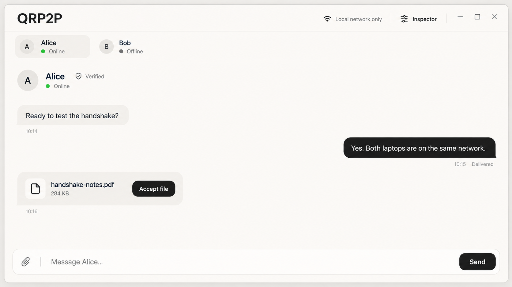
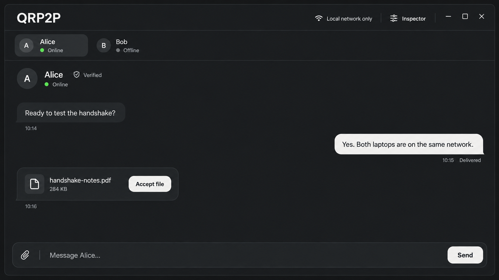
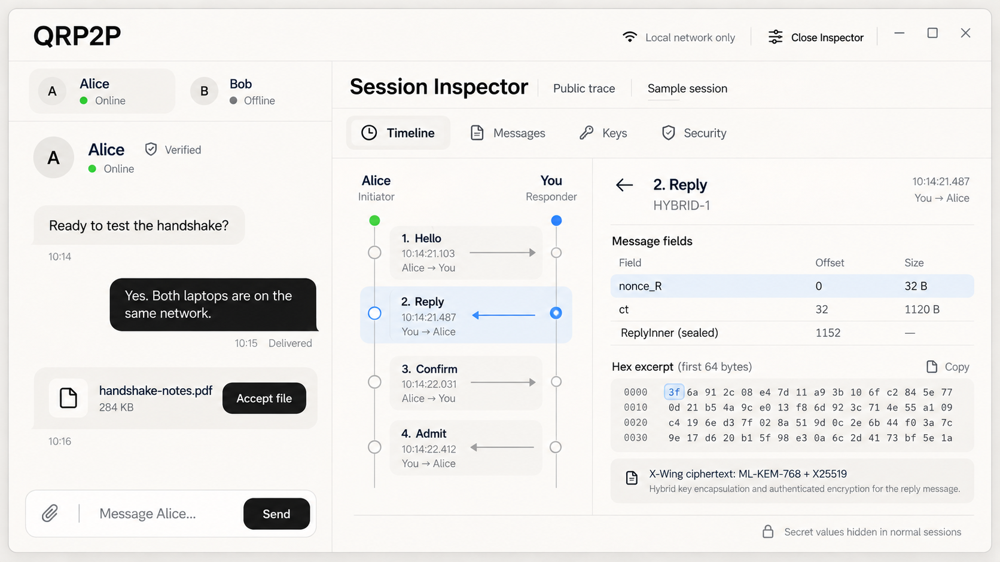
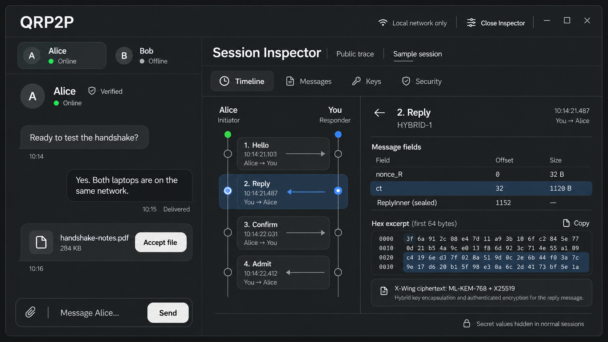
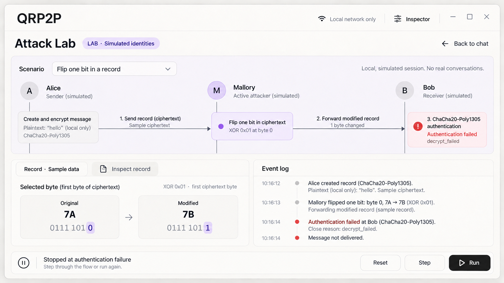
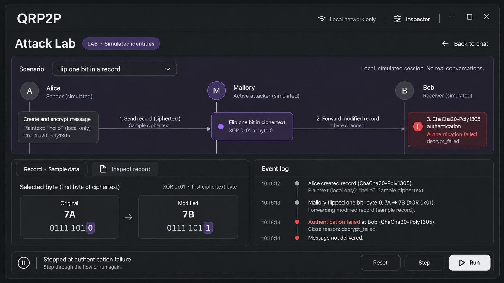

# QRP2P v2 — UI design and implementation guide

| | |
| --- | --- |
| Direction agreed | 2026-10-02 |
| Applies to | M3 desktop app, M4 Inspector and solo lab, M5 learning tools |
| Stack | Python, PySide6, Qt Quick/QML, custom components over Qt Quick Controls Basic |
| Visual direction | Minimal messenger; progressively richer inspection and experimentation |

This guide gives an engineer the visual language, interaction contracts and implementation
sequence for the desktop app. Read [DESIGN.md](DESIGN.md), especially §§5, 9–12 and 14–15, first.
That document remains authoritative for protocol, consent, visibility and lifecycle rules.
This guide develops its UI requirements; it does not introduce cryptography or change milestone
gates. Follow [IMPLEMENTATION_PLAN.md](IMPLEMENTATION_PLAN.md) for delivery scope.

The agreed direction replaces the earlier permanent left-contact-list / narrow Inspector-drawer
composition. Normal chat uses a compact contact strip. Opening Inspector reflows the same window
into a substantial inspection workspace. The type, surfaces and controls stay consistent.

## Contents

1. [Design philosophy](#1-design-philosophy)
2. [Reference mockups](#2-reference-mockups)
3. [Application structure and layout](#3-application-structure-and-layout)
4. [Visual tokens and themes](#4-visual-tokens-and-themes)
5. [Components and interaction](#5-components-and-interaction)
6. [Messenger and security flows](#6-messenger-and-security-flows)
7. [Inspector](#7-inspector)
8. [Glass-box and solo lab](#8-glass-box-and-solo-lab)
9. [Attack Lab and other learning tools](#9-attack-lab-and-other-learning-tools)
10. [Evidence and copy](#10-evidence-and-copy)
11. [QML architecture and performance](#11-qml-architecture-and-performance)
12. [Accessibility and platform behavior](#12-accessibility-and-platform-behavior)
13. [Implementation sequence and acceptance](#13-implementation-sequence-and-acceptance)
14. [References and asset provenance](#14-references-and-asset-provenance)

## 1. Design philosophy

### 1.1 An ordinary messenger with depth

The default experience is a calm conversation: choose a person, read messages, send text or a
file. The user should not have to understand the handshake to use the app. Show the selected
person, connection status, trust status and delivery state clearly, without surrounding them
with protocol statistics.

Depth becomes available through an explicit Inspector action. When opened, it earns space:
real exchanges, byte ranges, dependencies, state transitions and failures become the main
content. Preserve the conversation and its draft while making inspection comfortable.
Closing Inspector restores the chat layout and scroll position.

Minimalism controls the chrome, not the amount of useful evidence. A key graph or a hex view
can be dense when it answers the user's current question. Do not hide a significant trust or
consent state to make a screenshot cleaner.

### 1.2 The engine supplies the visual interest

Use the actual four-message handshake, hybrid KEM, transcript construction, key derivation,
directional counters, key generations, PQ rekeys and attack outcomes. A highlighted ciphertext
range or a visible dependency between a transcript and a signature is interesting in itself.

Every diagram should support selection and lead to its evidence. Avoid security scores,
decorative telemetry, progress invented from elapsed time, stock lock illustrations, terminal
walls, circuit patterns and particles that suggest operations the engine did not perform.

### 1.3 One visual language across modes

Messenger, Inspector, consent prompts and labs share type, spacing, buttons, focus treatment,
selection, detail panels and byte viewers. Learning tools add their necessary controls and
context labels. Opening Inspector does not switch the app into a different theme or an IDE skin.

The three visibility tiers remain distinct:

| Context | Persistent indication | What it means |
| --- | --- | --- |
| Normal session | Neutral canvas; Inspector says **Public trace** | Secret values are unavailable to this view |
| Glass-box session | Amber frame/banner; **GLASS-BOX** on every message | Both parties consented to exposing this session's permitted values |
| Solo lab / Attack Lab | Subtle violet canvas; **LAB · Simulated identities** | Local throwaway identities; experimentation is isolated from real sessions |
| Failure / weakened engine | Red at the relevant failure; persistent **WEAKENED ENGINE** banner where applicable | A specific failure or deliberately removed defense |

Use text and an icon alongside color. A lab is not a glass-box real conversation. A normal
Inspector is not evidence that secrets were captured. Appearance never grants a capability.

## 2. Reference mockups

These images are **ImageGen design studies, not screenshots of implemented QML**. They establish
composition, visual restraint and mode continuity. The written rules and engine data take
precedence over image text, sample bytes, timings and geometry. Do not embed these pictures as
application UI or use their data as protocol fixtures. Provenance and prompts are in the
[asset notes](assets/ui/README.md).

### 2.1 Minimal messenger — light



Carry forward the neutral surfaces, restrained contact strip, readable bubbles and compact
actions. Reduce the oversized wordmark to the type scale below. The actual contact chooser
must also expose short IDs, trust, unread counts, Nearby and manual connection; the picture
does not show every required state.

### 2.2 Minimal messenger — dark



Dark mode has the same hierarchy. Outgoing bubbles and primary controls use the light primary
fill with dark text. Secondary surfaces use a small luminance change rather than shadows.

### 2.3 Inspector — light



The selected frame connects the timeline, field table and hex view. In the implementation,
the selected field, highlighted bytes and explanation must agree. This image highlights
`nonce_R` while the explanation describes `ct`; that is a mockup inconsistency, not an intended
interaction. Its dash for the sealed-region size is also illustrative: show the actual captured
size when known.

### 2.4 Inspector — dark



Use a restrained selection color across the arrow, row and bytes. Keep timestamps, offsets,
sizes, concealed-value labels and inactive tabs legible. Dark mode does not authorize more
information than light mode.

### 2.5 Attack Lab — light



The causal sequence is the dominant visual. The mutation and outcome have different semantic
colors. The byte comparison shows `0x7A XOR 0x01 = 0x7B`, highlighting the final bit in both
values. Timing, selected bytes and run state are examples; actual controls must reflect the
lab controller. At a terminal failure, Step and Run cannot pretend the closed channel continues.

### 2.6 Attack Lab — dark



Violet identifies the experiment; red identifies the failed authentication. Preserve the
neutral background and keep both signals local and readable. Avoid a full-screen alarm effect.

## 3. Application structure and layout

### 3.1 Shared shell

Use one application shell with a small product label, contact access, selected conversation,
Inspector action, and application menu containing Settings, Lock and Learn. Use native window
decorations initially. The drawn window buttons in the images are illustrative.

The compact contact strip shows a bounded set of recent contacts and the selected contact.
Use an **All contacts** chooser for the full list, with separate Contacts and Nearby sections
and an **Enter address** action. A starting limit of five strip items is reasonable; reduce it
as space becomes scarce. Do not wrap dozens of contacts into multiple header rows. The chooser
may use a searchable virtualized list once the contact count warrants search. Chips already in
the strip keep their places when their contact becomes more recent; a newcomer enters at the
front. A message from a visible contact must never reshuffle the chips under the pointer.

Each contact item exposes name, short ID, trust, availability and unread count in a compact
form or accessible detail. Trust cannot depend on an avatar or display name. Nearby items
remain unauthenticated discovery hints. Discovery presence is not an established session.

### 3.2 Conversation layout

Start the window at approximately 1280 × 800 logical pixels. Support approximately 800 × 600
with reflow, OS scaling and longer content; these are layout targets, not immutable dimensions.
Use a centered reading column around 720–800 logical pixels in normal chat, with room to expand
for long content. Bubbles occupy at most about 75% of that column. Wide empty space is acceptable
when it helps reading; it should become useful workspace when inspection is opened.

Keep the composer at the bottom of the conversation pane. The message list owns vertical
scrolling. Stick to the newest message only while the user is already following the end. If
they scroll up, preserve that position and show an unobtrusive unread/new-message action.

### 3.3 Inspection layout

Inspector is a resizable workspace, not a narrow overlay covering the chat:

- At generous widths, reserve about 25–35% for chat and the rest for Inspector. Split Inspector
  into the active visualization and a selected-item detail pane when each fits comfortably.
- Around 1000 logical pixels and below, show Inspector as the principal pane with a clear
  **Back to chat** action. Preserve the conversation, draft and Inspector selection in memory.
- Stack the selected-item detail beneath the visualization when a horizontal split would
  squeeze labels. Allow genuine tables/hex rows to scroll within their own pane.
- Offer **Expand Inspector** / **Restore split** on wide windows. Remember pane sizes as UI
  preferences, clamp them to current usable dimensions, and provide a reset in Settings.

Keep at least roughly 320 logical pixels for a visible chat pane and 560 for a useful Inspector;
switch composition before shrinking text to fit. Breakpoints must use available content width
and text scale, including window decorations and platform scaling.

Opening or closing Inspector is a 150–250 ms layout transition. Do not animate every incoming
event. Reduced-motion mode uses immediate transitions. Never alter networking to serve the
animation.

### 3.4 Lab navigation

Learn opens a hub for Solo Lab, Attack Lab, Algorithm Lab and lessons as their phases land.
Entering a lab replaces the main workspace; it does not convert a real contact's session.
Keep a clear **Back to chat** action, restore the draft and selection, and retain the LAB label
even in expanded inspection. Real connections may continue in the background while unlocked.
Locking still closes sessions and clears sensitive state according to DESIGN §10.4.

## 4. Visual tokens and themes

### 4.1 Semantic colors

These are initial implementation tokens, not sampled image colors. Centralize them in a QML
theme object. Components use semantic names; they do not pick arbitrary local hex values.
Adjustments are allowed after reviewing real QML, provided contrast, hierarchy and semantics
remain intact. Update this table when adopting a different palette.

| Token | Light | Dark | Purpose |
| --- | --- | --- | --- |
| `canvas` | `#FAF9F6` | `#151718` | Application background |
| `surface` | `#FFFFFF` | `#1D2022` | Inputs, popovers, dialogs |
| `surfaceSubtle` | `#F0EFEB` | `#24282A` | Incoming bubbles, understated groupings |
| `text` | `#242628` | `#EFF1F2` | Main text |
| `textSecondary` | `#60666B` | `#B3B7BA` | Timestamps, descriptions, supporting values |
| `divider` | `#DEDFDB` | `#3A3F43` | Decorative separation; not a control boundary |
| `controlBoundary` | `#858B90` | `#9AA1A6` | Boundaries needed to identify an input/control |
| `primaryFill` | `#242628` | `#EFF1F2` | Main action and outgoing bubble |
| `primaryText` | `#FFFFFF` | `#151718` | Text/icons on primary fill |
| `selectionFill` | `#E7EDF6` | `#253446` | Related selected events, fields and bytes |
| `selectionText` | `#294D79` | `#BBD1F1` | Text on selection fill |
| `focus` | `#365D96` | `#91B4E8` | Keyboard focus, distinct from selection |
| `success` | `#2D653F` | `#91CDA3` | Verified contact or explicitly successful check |
| `exposureText` | `#865517` | `#EAC17C` | Glass-box / exposed recording |
| `exposureFill` | `#FFF2DA` | `#382D1E` | Exposure banner surface |
| `labText` | `#614687` | `#BEADF3` | Lab context and mutation annotation |
| `labFill` | `#F2ECFA` | `#2E273B` | Subtle lab surface |
| `dangerText` | `#AA343D` | `#EE9B9B` | Failure or dangerous action |
| `dangerFill` | `#FBEAEC` | `#392329` | Failure detail / weakened-engine banner |
| `hoverFill` | `#F4F3EF` | `#202426` | Pointer hover on quiet controls and rows |
| `pressedFill` | `#E7E6E1` | `#2B3033` | Pressed state, distinct from hover and selection |
| `primaryHover` | `#3A3D40` | `#FFFFFF` | Hovered primary action |
| `online` | `#2F8A4C` | `#7FC495` | The open-session dot (always beside the word *Online*) |
| `avatarFill` | `#E6E5E0` | `#2C3134` | Identity circle behind an initial |
| `scrim` | `#242628` at 35% | `#000000` at 60% | Behind modal dialogs |

Neutral actions keep the main UI quiet. Selection blue is a functional focus of attention,
not a second branding palette. Green does not mean the entire protocol has been certified.
Persistent identity, exposure and lab indications use their explicit text labels.

### 4.2 Dark mode contract

Provide **System**, **Light** and **Dark**, defaulting to System. Apply theme changes to already
open panes, menus, dialogs, hex selections, graphs and tooltips without recreating sessions or
losing input/focus. Before unlock, use System; apply the encrypted appearance preference after
unlock. Do not introduce an unencrypted settings file merely to theme the unlock screen.

Dark mode uses charcoal, not pure black. Off-white text and light primary buttons preserve
the monochrome hierarchy. Avoid opacity-based dimming of whole panels, because it also dims
their text. Distinguish layers through the surface tokens and geometry rather than large
shadows. Selection, focus, failure and exposure remain distinguishable in both themes.

Measure rendered contrast, including hover, pressed, selected and disabled-adjacent states.
Use WCAG 2.2 AA contrast targets as engineering acceptance criteria: at least 4.5:1 for normal
text, 3:1 for qualifying large text, and 3:1 for essential non-text controls/graphical information.
Decorative dividers may be subtler. Do not use them as the sole boundary of an editable field.
The token pairings above pass the stated targets for main/secondary text, selection text,
semantic banner text, focus on canvas and control boundaries on surface. The pairs the M3
components actually compose (text on every fill, banner text, the online dot, the glass-box
frame) are measured in both themes by `tests/ui/test_contrast.py`, which reads `Theme.qml`.
See the [contrast references](#14-references-and-asset-provenance).

### 4.3 Typography and geometry

Bundle Inter under its license for interface text. Use a readable monospace system fallback
for bytes, offsets, counters, hashes and equations. Bundle a monospace font only after checking
its license and packaging. Keep long public values selectable and give them an explicit copy
action; shortened values must offer the full value on activation.

| Role | Starting size / weight |
| --- | --- |
| Body, controls, messages | 14–16 logical pixels / regular |
| Supporting label, timestamp, table header | 12–13 / regular or medium |
| Pane title, product wordmark | 18–20 / medium |
| Workspace heading | 24–28 / medium |
| Bytes and technical values | 12–14 / regular monospace |

Use regular and medium weights. The images' very large product label is not a required logo.
Use tabular figures for aligned changing numbers. Never reduce evidence below 12 logical
pixels to fit a panel; enlarge, reflow or scroll it. Respect user text scaling.

Use a 4-pixel spacing unit: 4, 8, 12, 16, 24 and 32. Start with 24-pixel workspace padding,
16-pixel pane padding, 8-pixel control gaps, 36–40-pixel ordinary controls, and larger effective
targets for touch. Corners: about 8 for controls, 12 for bubbles/file items/dialogs, and 4 for
technical selections. Circles are for compact identity avatars, not every action.

Default panels rely on whitespace and an occasional divider. Cards are justified for a file
offer, consent decision or bounded selected evidence; do not box every row and label. Use
opaque popovers/dialogs and modest shadows only where necessary to establish their layering.

## 5. Components and interaction

Implement a small shared component set before individual screens:

| Component | Contract |
| --- | --- |
| `AppButton` / `IconButton` | Primary, secondary, quiet and danger variants; visible focus, busy and disabled states; accessible action name |
| `StatusLabel` / `TrustIndicator` | Label + icon + semantic color; connection, trust and visibility are separate inputs |
| `ContactStrip` / `ContactChooser` | Selected contact and unread state; scalable full list; separate untrusted discovery entries |
| `MessageBubble` / `DeliveryLabel` | Direction and sender from session; plain text; status from service events |
| `FileTransferItem` | Offer, accepted, transferring, complete, declined, cancelled, failed; measured bytes and meaningful actions |
| `PaneHeader` / `InspectorTabs` | Concise heading, current context and local actions; keyboard tab behavior |
| `EvidenceRow` / `DetailPane` | Named value, origin, units/visibility, selection and permitted copy |
| `HexView` | Virtualized bytes; selectable range; labeled offset basis; keyboard equivalent to pointing |
| `ProtocolTimeline` / `KeyGraph` | Data-driven structure and state; selection has a textual alternative |
| `ConsentDialog` / `FailureDetail` | Clear authenticated identity, consequence, action and reason |

The names are proposed implementation names, not APIs already present in the repository.
Build controls on Basic controls/templates so their input and focus behavior can be preserved.
Do not turn every clickable item into a raw Rectangle with only a MouseArea.

Primary actions are content-sized and clearly named. Busy prevents duplicate submission but
does not imply success. Disabled actions explain their prerequisite where it is not obvious.
Hover, keyboard focus, pressed and selected are distinct states. Tooltips supplement visible
content; they never contain the only explanation of exposure or a dangerous action. A tooltip
appears beside its control, never over it, so the control stays clickable. Buttons keep the
platform's arrow pointer; a busy button alone shows the busy pointer. Scroll bars never cover
content. Editable and selectable text has the platform's context menu (Undo, Redo, Cut, Copy,
Paste, Select all; read-only text Copy and Select all); a masked password is never copied out.

Select via click/tap or keyboard. Double-click is optional acceleration only. Popovers close
with Escape and return focus to their invoker. A modal moves focus inside, contains keyboard
navigation and returns it on close. Inspector opening moves focus to its heading or active tab;
closing returns it to the previous conversation control where practical.

## 6. Messenger and security flows

### 6.1 Onboarding, unlock and lock

Use a compact, calm form: create/unlock vault, password, optional display name, and a clear
primary action. Explain that key derivation deliberately takes roughly a second; show busy
activity, not fabricated percentage completion. Present identity sizes as expandable facts,
not a startup dashboard. Password fields use password semantics and never log their content.

Remember-on-device is explicit opt-in and describes the OS keychain dependency. Show unavailable
backends as unavailable. On lock, remove chat history, drafts, prompts, trace caches and revealed
lab/glass-box values from UI models; close sessions and stop discovery through the node. Drop
references without claiming Python has securely wiped memory. No stale sensitive tooltips or
copied detail pane survives the locked view.

Every surface that can show unlocked data has the lifetime of the unlocked period: dialogs,
popovers, tooltips, toasts and their queues, menus and accessibility text live inside the
workspace's view and are destroyed with it. Nothing that names a contact or shows its content is
owned by the window itself.

Password rotation has a commit boundary. If the service reports a committed password change
with failed storage cleanup, say **Password changed; vault cleanup failed** and make clear that
the new password is active. A generic storage error must not be presented as proof that the old
password still works. Preserve recovery headers and use the service's recovery result; QML
must not edit vault files or retry a rotation automatically.

### 6.2 Contacts, discovery and connection

Empty chat offers **Find nearby peers** and **Enter address**. Empty discovery says no peers
were found and keeps manual connection accessible. Do not assert a cause such as a firewall
block unless known; offer it as a possible explanation for an unreachable peer.

Keep Nearby, Connecting, Waiting for admission, Connected and Offline distinct. A saved
Verified contact can be offline. An advertised name can be forged. Contact-request prompts
show the authenticated identity, short ID and selected profile once those facts are available.
Accepting a first contact pins it; it does not mark it Verified.

An admission prompt is a pending request, not a reserved connection slot. Acceptance may become
**Busy** if capacity was consumed while the prompt was open. Show the actual decision result,
remove an expired/ended request, and bind the action to its session and request identity. A
stale prompt must never accept a replacement session merely because its contact is the same.

### 6.3 Messages and files

Render every peer-supplied name/message/file label as plain text. QML rich-text autodetection
must be explicitly disabled for those values. Preserve message content, wrap long text, and
make sender/direction depend on the session rather than fields supplied by the peer.

Use the service's Sending, Sent, Delivered and Failed states. Delivered requires the matching
encrypted receipt; it does not mean read. Show failed unsent history after crash recovery and
do not silently resend it. Enter sends, Shift+Enter adds a line; document this near the composer
or in Help and respect IME composition. The composer grows with its lines up to six, then
scrolls with the cursor. Do not retain drafts across lock through plaintext
settings.

File offers show sender, sanitized name and actual size, with Accept and Decline. Transfers
show measured progress; the sender reaches complete only after the final receiver confirmation.
Keep Cancel accessible. An ended session makes the transfer failed; v2 does not offer Resume.
Open is explicit after completion; received files never open themselves. Native file/folder
dialogs follow platform behavior where available.

### 6.4 Verification and key mismatch

Verification uses all 60 digits in 12 groups of five, with a readable responsive grid. Explain
comparison through an already trusted channel. **Mark as verified** is an explicit user action,
not the result of a successful signature check. QR verification remains outside v2.0 scope.

On the initiating side, key mismatch shows old and new fingerprints, the authenticated fact
that they differ, a concise MITM explanation, and **Cancel** / **Re-pin**. Cancel is the safe
default. Do not reduce the prompt to a dismissible toast. Re-pin follows DESIGN §5.3: Pinned,
never Verified; auto-accept off; visible identity-change history marker; recommend comparison.
The responder seeing an unknown bundle uses a normal contact-request flow, not a fabricated
key-mismatch alarm associated with an existing display name.

### 6.5 Settings

Group settings into Appearance, Identity/discovery, Contacts/profile, History/locking and
Device/storage. Support System/Light/Dark, reduced motion, text scaling where practical,
retention, auto-lock, display-name visibility, port, default/per-contact profile, explicit
keychain opt-in and verified-contact file auto-accept. Explain when a change applies to the
next connection rather than modifying an established session. Keep lab-only algorithms and
weakened engines out of real-session profile controls.

## 7. Inspector

### 7.1 Shared selection and navigation

Each session has a stable view-model identity. Each captured event gets a session-scoped
ordinal assigned at the bridge/model boundary; do not use a recycled visible row index as
its identity. Selection includes session, event, optional field/range and optional key node.
Tab changes preserve that selection when a related view exists.

The intended traversal is concrete:

1. Select Reply in Timeline; the detail pane shows that captured frame.
2. Select `ct`; Messages selects the matching byte range and its explanation.
3. Inspect X-Wing's public layout or its specification; Keys can locate the related derivation
   when an explicit event/dependency mapping exists.
4. Select a transcript hash; show its name/digest and the documented contributing entries.
5. Select a key change; show direction, epoch/generation and the event that caused it.

Cross-links must be backed by an explicit mapping. If existing traces do not identify a
relationship, label the graph edge as a specification relationship or add a reviewed public
trace event; do not infer it from nearby timestamps. Do not promise packet-to-chat-message
mapping from `RecordTraced.kind` alone: multiple messages can have the same kind.

### 7.2 Timeline

Use a sequence diagram with correct initiator/responder roles and send/receive direction,
plus an accessible event list. Local labels may be You and the peer's authenticated name.
Show Hello, Reply, Confirm, Admit, records, KeyUpdate, rekey steps and close events from traces.
Record-heavy sections may collapse into labeled groups; selecting a group exposes its events.
Failures stop at the actual observed stage, with reason and relevant evidence.

The local trace has one local monotonic timestamp per observation. Display relative elapsed
time from that session's first retained event. A peer lane represents the other participant,
not a measurement taken on its host. Label clock origin. A remote send time, network RTT,
operation duration or CPU time needs its own instrumentation; absence is **Not measured**.
Gaps can include scheduling, networking and user admission delay.

Opening Inspector reads the retained ring and subscribes to updates in the services thread.
Snapshot/subscription handoff must neither duplicate nor miss events. The current bus retains
10,000 events per session and a bounded set of ended sessions. When older events are evicted,
show **Earlier events no longer retained**. Retained public traces are not durable recordings.

**Pause following** freezes a bounded display snapshot, while networking continues. **Follow
live** resumes the retained stream and reports any gap. Scrolling/selecting older evidence
must not be forcibly reset by incoming events. Step/Run/Fork belong to the lab controller.

### 7.3 Messages and bytes

The default view is the captured frame, its 5-byte header, and the body as transmitted. In
normal sessions, `ReplyInner`, Confirm, Admit and record bodies remain sealed in the public
trace. Local chat rendering does not authorize copying plaintext into the trace bus.

`Field.offset` in the current dissector is body-relative. Label **Body offset** explicitly;
if showing whole-frame offsets, add the header length and label **Frame offset**. Half-open
ranges `[offset, offset + length)` drive highlights, explanations and copy. Byte selection
can be longer than the visible excerpt; label excerpt/truncation and preserve the full
permitted source. Copy hex/raw needs an explicit user action.

For a valid `HYBRID-1` Reply, body layout is:

| Field | Body offset | Bytes | Public trace visibility |
| --- | --- | --- | --- |
| `nonce_R` | 0 | 32 | Public bytes |
| `ct` | 32 | 1120 | Public X-Wing ciphertext |
| `ReplyInner (sealed)` | 1152 | 7998 | Ciphertext bytes; no decrypted fields |

Whole-frame offsets are 5, 37 and 1157. The Reply body is 9150 bytes, plus the 5-byte header.
Inside `ct`, ML-KEM ciphertext is 1088 bytes and the X25519 ephemeral public component is
32 bytes. Derive these sizes from the profile/codec; this example explains the UI, it is not
a second hard-coded parser. Unknown or malformed fields must not be prettified into validity.

### 7.4 Keys

Draw the key schedule from DESIGN §§4.2, 7.4 and 8.4 as a dependency graph. Use public labels,
sizes and named transcript hashes. For HYBRID-1, distinguish X-Wing's SHA3-256 combiner from
the handshake's HKDF-SHA-256. The combiner includes `ssM`, `ssX`, `ctX`, `pkX` and its fixed
label; it is not simply an unexplained concatenation of two secrets.

Progressively expand handshake secrets, directional traffic secrets, finished keys, chaining
secret, application keys/IVs and rekey epochs. Highlight a selected node's inputs/outputs;
dim unrelated edges while keeping labels readable. Show concise operation/label/context detail
on selection, with a specification link. Support keyboard traversal and a dependency list.

Distinguish **Specification relationship**, **Derived (observed)**, **Hidden in normal session**,
**Value available in this glass-box/lab trace**, and **No longer retained / unavailable**.
A lifecycle erasure indicator needs an emitted lifecycle fact, not a guess based on elapsed
time. Do not claim physical memory zeroization. The graph's presence is not secret capture.
Revealed values need the provider/consent path; QML never reaches into live key objects.

Show `cs_n` as a transient derivation root. Its traffic secrets, exporter and next-rekey salt
are separate children; normal channel state retains the derived salt rather than the root.
Each direction consumes its pending traffic secret when it switches, including a partial PQ
rekey. A KeyUpdate may advance one direction while the other is still on its previous epoch or
generation. Keep those states separate in the graph. Values intentionally captured by an
exposed recording may remain available after the normal engine releases its references;
label that recording origin rather than claiming the engine still retains them.

### 7.5 Security

Show session facts with their evidence and assumptions: selected profile, identity pin result,
out-of-band verification state, exposure tier, authenticated completion, key changes and
observed failures. Separate signature verification from a human verifying the safety number.
Explain first-contact limitations plainly. A successful session does not demonstrate all
adversarial properties or replace external review.

A useful entry reads **Profile: HYBRID-1**, names its algorithms, explains the hybrid assumption,
and links to profile/transcript evidence. A failure reads **Authentication failed** with the
actual close reason and its local/peer-reported origin. Never create a percentage security
score. Follow DESIGN §15's gate before labeling the protocol secure.

## 8. Glass-box and solo lab

Glass-box is requested when connecting to a pinned contact, granted after authentication,
and bound into the transcript. It cannot be enabled retroactively from Inspector. Use explicit
request and accept/decline wording explaining that all permitted session keys/messages can be
seen and saved by both participants. Declining exposure can yield a normal session under the
admission policy; do not imply that declining exposure always rejects the contact.

Keep the amber indication in expanded/split views, per-message GLASS-BOX tags and EXPOSED
recording labels. Real identity private keys never appear, including in glass-box. Secret
buffering, admission gating, reveal sinks and canary tests follow DESIGN §11.3; a hidden QML
item is not a security boundary. Clipboard copies and recording saves must be explicit.

Solo lab uses separate throwaway identities and the real protocol core through its controller.
It shares Inspector components but adds Step, Run, Reset, Replay and Fork when implemented.
Replayed randomized provider outputs are recorded and checked; do not advertise regeneration
from a seed for operations whose API cannot supply randomness.

The run controller decides legal actions. At a terminal failure, Run/Step are disabled and
Reset starts a fresh experiment. Loading `.qrlab` remains bounded, validated and lab-only.
Errors name the problem without exposing secret payloads in logs/exceptions. Persistent
recordings are explicit saves, not a side effect of opening a pane.

Define execution steps before wiring the controls. The current core executes a complete input
transition and then returns its events. Moving through those events selects evidence; it does
not suspend execution between the operations they describe. Initially, Step advances one
declared protocol/transport transition. Display an operation's name when inspecting its event,
but do not label that action execution stepping. Fork is enabled only at boundaries the
controller can restore and replay. Finer operation stepping needs an explicit engine/controller
mechanism and its own tests. Pause following in a live Inspector remains a display operation.

## 9. Attack Lab and other learning tools

### 9.1 Scenario interaction

Each scenario starts with one concrete question and a compact configuration. Run or Step
produces the actual trace. Select the intervention, then inspect the changed input, affected
operation and outcome. Keep original and modified values adjacent with only changed bits/bytes
highlighted. The terminal result cites the event/check that produced it.

For bit flipping, the causal sequence is: Alice seals a record → Mallory changes ciphertext →
Bob attempts authentication → `decrypt_failed` → no message delivered. Bob's lane must not
display rejected plaintext as a delivered message. Mallory is an active attacker. Replay can
fail with the same close reason; the normal receiver must not claim it knows which attack caused
a generic authentication failure. The lab knows its injected intervention and labels that origin.

The engine and regression test, not the lesson script, decide whether an attack succeeds.
Experiments that succeed under their assumptions must visibly succeed: first-contact MITM
without safety-number comparison is not a green blocked-attack demonstration.

### 9.2 Choose the visual that explains the scenario

| Scenario family | Primary evidence / visual |
| --- | --- |
| Passive observation | Captured public frames/ciphertext; which values the observer can access |
| First-contact / pinned-contact MITM | Alice–Mallory–Bob identities, pins and differing safety numbers; actual admission/abort stage |
| Bit flip, replay, reorder | Byte or ordering difference, receiver's local expected counter, actual authentication failure |
| Profile/flag tampering | Original/modified Hello and transcript-dependent failure; no invented successful downgrade |
| Harvest now, decrypt later | Classical/hybrid recordings side by side; explicitly **Simulated quantum oracle** and controlled secret disclosure |
| Compromise / recovery | Key epochs, disclosed material and records it opens; lockout after actual signed PQ rekey |
| Oversized / malformed input | Size limit or parsing check and measured resource behavior; no decorative flat-memory graph |
| Vault guessing | Actual KDF parameters and clearly labeled estimates with machine/assumption context |
| Short-code grinding | Attempts and matching code from the lab run; the real 60-digit safety number remains distinct |

Weakened engines carry a persistent red WEAKENED ENGINE banner, naming the missing defense.
Compare honest and weakened runs with matched scenario/configuration, not hard-coded outcome
cards. Weakened variants and LAB-CLASSICAL are unavailable to real session controls.

### 9.3 Algorithm Lab and lessons

Algorithm Lab shows measurements on the user's machine: operation, algorithm/parameter set,
size, sample count and timing method. Use the specified log-scale size-versus-time plot with
units, accessible results and explicitly failed/unavailable algorithms. Missing liboqs is
**Lab algorithms unavailable**, not a fabricated result or an installation spinner.

Lessons guide selections and experiments inside the same workspace. Put goal/step/checkpoint
in a compact panel that can collapse. Progress follows defined completion/checkpoint behavior,
not mere screen visits. Keep a path back to the underlying evidence after explanatory text.
The toy ML-KEM visualizer remains a labeled stretch goal, outside initial M3–M5 delivery.

## 10. Evidence and copy

Every technical item needs a value, units, context and origin. Use an origin such as **Captured
wire bytes**, **Local protocol state**, **Provider trace**, **Specification**, **Lab intervention**,
**Measured on this machine**, or **Estimate** where ambiguity would matter. Not every row needs
a badge; origin may be a column, pane label or selected detail.

Use **Not measured**, **Not captured**, **Hidden in normal session**, **Sealed**, **Unavailable**
and **Earlier events no longer retained** for their specific causes. Zero is an observed value,
not a substitute for absence. A counter is local state, not a field transmitted in the frame.
An expected key size comes from the profile; a captured size comes from the bytes.

Explain first, then show the exact reason/identifier nearby. Examples:

| User-facing copy | Technical detail / qualification |
| --- | --- |
| Message delivered | Matching receipt received; no read receipt is claimed |
| Identity differs from saved contact | Old/new bundles; Cancel / Re-pin; initiator-side mismatch |
| Authentication failed | `decrypt_failed`; local failure or reported by peer |
| Connection lost | No authenticated close reason was received |
| Earlier events no longer retained | Ring eviction; current visible range |
| Secret value hidden | Normal provider cannot supply it; no Reveal action |

Keep peer names untrusted and distinguish system notices from peer messages. Long IDs may be
shortened for display with full selectable detail; byte-copy always copies the permitted exact
value and states its format. Do not auto-copy secrets or auto-save an exposure recording.

## 11. QML architecture and performance

### 11.1 Existing foundations versus planned work

M3 built the messenger on these foundations (§11.2 describes the result). Available inputs are:

- [`services.node.Node`](../../src/qrp2p/services/node.py): front-end commands and node events;
  the CLI is an example of driving it.
- [`services.trace_bus`](../../src/qrp2p/services/trace_bus.py): local timestamp/session wrapper,
  retained public events and subscription callbacks.
- [`core.trace`](../../src/qrp2p/core/trace.py): `FrameTraced`, `StateChanged`, `SecretDerived`,
  `TranscriptHashed`, `RecordTraced`, `KeysSwitched`, `RekeyStep`, `SessionClosed`, and dissector.
- [`core.crypto.provider`](../../src/qrp2p/core/crypto/provider.py): provider boundary and basic
  reveal wrapper; recording/replay and complete admission-buffer integration are M4 work.

| Current event | Initial presentation | Limit |
| --- | --- | --- |
| `FrameTraced` | Direction, actual frame/header/body, field ranges | Sealed regions remain ciphertext |
| `StateChanged` | Named machine transition | Does not provide all per-check timings |
| `SecretDerived` | Label and length | No secret value |
| `TranscriptHashed` | Name and public digest | Contributing byte mappings need a reviewed adapter/event source |
| `RecordTraced` | Local direction, epoch, generation, sequence, length, kind | No plaintext; kind alone is not a message-ID correlation |
| `KeysSwitched` / `RekeyStep` | Key evolution and cause/step | Not a proof of physical zeroization |
| `SessionClosed` | Named reason, admission reason and peer origin | Not a diagnosis of a specific attack |

Do not invent missing signature-check events, CPU timings or key lifecycle events in QML.
Add public trace instrumentation in the relevant phase when needed, with tests and the same
visibility rules. Public metadata may require careful review if it leaks message correlation.

### 11.2 Organization (as built in M3)

```text
ui/
  app.py                    # Qt startup, fonts, icon provider, the `qrp2p` entry point
  host.py                   # the services thread: owns the Node, generations, batching (no Qt)
  ops.py                    # the requests view models may make (each runs on the services thread)
  snapshots.py              # immutable values that cross the bridge, built on the services thread
  bridge.py                 # Qt side: queued deliveries, generation filter, per-period Scope
  text.py, icons.py         # display-safe peer text; Lucide icons tinted per theme
  viewmodels/
    application.py          # which screen shows, unlock/lock, appearance, password change
    workspace.py            # one unlocked period: contacts, strip, Nearby, selection, routing
    conversation.py         # history (race-free load), drafts, delivery, files, contact actions
    prompts.py              # contact/glass-box requests and key mismatches, with real outcomes
    settings.py, rows.py    # the Settings screen; pure row builders for every list
    listmodel.py            # list models updated by minimal diffs
  qml/Main.qml, qml/Qrp2p/{Theme,Components,Screens}/
  resources/                # Inter (OFL), Lucide (ISC), app icon
```

Only `host.py` and `ops.py` touch the node, and only on the services thread; QML never reaches
a live object. Read node state and subscribe to `Node.trace` on the services thread when the
Inspector arrives (M4); never let QML call core machines or traverse mutable live engine state.
Copy safe event batches across the boundary through queued signals. Qt list/table models mutate
on the Qt thread. A trace callback must be bounded and fast; it cannot synchronously render, hash,
format huge hex strings or block the service loop.

`Node.session_info()` and `Node.transfers()` return mutable service objects: they are
services-thread inputs to `snapshots.py`, never Qt properties. Snapshots hold primitive values
(IDs as hex, display-safe text, numbers): contact, session (profile, exposure, role), message,
file transfer, prompt, mismatch, settings, identity and network facts. Requests return their real
outcome (an accepted prompt can still end *busy*); a successful local enqueue is not a completed
remote action.

Each unlocked lifecycle has a generation, assigned by the services thread at every node state
change; the unlocked snapshot is taken in the same step. Every delivery carries it; the bridge
stops accepting data when the user locks, before the node has started closing sessions, and drops
anything not of the current unlocked generation. View models of one period request through a
`Scope` pinned to its generation, so a stale dialog cannot answer a request of a later period even
when the node reuses an ID. Locking destroys the period's workspace view model and every QML view
of it. Tests cover lock with queued updates, a stale prompt after relock, replies racing a history
load, admission ending busy, and an interrupted password change. This generation is local bridge
state, not a protocol field.

Data flows one way: view-model properties are read-only to QML, and QML states intent through
slots. Lists are pure functions of the snapshots, applied as minimal model diffs (moves, runs of
inserts/removals, per-role changes), so delegates keep focus and scroll position.

Choose one Basic style-loading strategy consistently; consult the pinned Qt documentation. M3
sets the Basic style at startup and builds its controls on `QtQuick.Templates` roots
(`AppButton`, `AppTextField`, `AppDialog`, `AppComboBox`…), with no custom style module.
Every text item is `AppText` (plain text fixed) or sets `textFormat` to plain text explicitly;
`tests/ui/test_qml.py` enforces this statically and checks every text item of a live window.

### 11.3 Performance and lifecycle

Use virtualized `ListView`/table models for contacts, history and events. Hex renders visible
rows; diagrams lazily expand large event/key groups. Draw graphs/sequence diagrams with QML
items or an appropriate scene-graph implementation plus semantic selection targets; do not
use screenshot images as the diagram. Use Qt Graphs for measured Algorithm Lab charts when
that phase arrives, not for every two-node protocol picture.

Batch visual event updates at at most 30 Hz; preserve actual event times and ordering.
Bound the bridge queue and paused snapshots; when overflow prevents a complete view, show a
gap marker and resnapshot the bounded source. Never let a paused UI cause an unbounded trace
queue. Use incremental model changes rather than rebuilding all delegates each batch.

No cryptography, disk work or heavy recording import on the Qt thread. Do not create a timer
per event or animate every packet. Theme changes use shared bindings. Hidden Inspector tabs
do not keep expensive rendering active. Disconnect subscriptions when sessions/views end;
lock clears retained view data and reveals, including accessibility strings and export buffers.

Budget bytes as well as event counts for bridge queues, paused snapshots and retained evidence.
The source ring's 10,000-event limit is a count bound; full captured file frames can make it
large. Measure memory with concurrent file transfers and ended sessions before M4 acceptance,
and add a reviewed source byte budget if needed. Gaps and eviction must remain visible. A slow
or hidden frontend must not stall networking or retain an unbounded sequence of copies.

## 12. Accessibility and platform behavior

Use native desktop window behavior, menus, clipboard and file dialogs where available, while
keeping shared QML content across Windows/macOS/Linux. System styling is not a requirement
for custom content. Do not reproduce fake macOS/Windows controls inside the QML client area.

Use Control on Windows/Linux and Command for equivalent application shortcuts on macOS.
Inspector is Ctrl+I / Cmd+I. Tabs support arrows, Home/End and activation. All evidence
selection, copy, lab stepping, dialog actions and split restoration work from the keyboard.
Retain platform text editing shortcuts and IME behavior. Do not assign unmodified keys that
interfere with typing in the composer.

Expose QML Accessible names, roles, states and actions. A protocol graph needs a synchronized
textual event/dependency view; its arrows are not the only way to understand it. Trust and
exposure status are announced when meaningfully changed. Do not announce every live packet.
Icons alone have an accessible name; decorative icons do not duplicate the visible label.

Verify contrast in both themes, focus on every supported surface, and readable text at 125%,
150% and 200% scale. Test high-DPI rasterization, long names, mixed scripts, bidirectional text,
unbroken hashes and long filenames. Peer text must not spoof system presentation. Test the
actual QML on all three OSes; an HTML prototype or generated screenshot is not platform QA.

## 13. Implementation sequence and acceptance

### 13.1 M3 — build the messenger and visual foundation

1. Add PySide6 as the `gui` extra when first imported. Build the bridge and application state;
   keep services/headless CLI free of Qt.
2. Implement theme/type/geometry tokens and shared controls in light and dark from the start.
   Make clickable QML prototypes of messenger, contact chooser, unlock and security prompts.
3. Review those prototypes at desktop/narrow widths and enlarged text on the three OSes.
4. Wire contacts/discovery/manual connect, node lifecycle, history/delivery and file transfer.
5. Wire contact requests, safety-number verification, mismatch and Settings. Include truthful
   empty/loading/error states and all exposure indicators for any already reachable mode.
6. Prepare the split/expanded Inspector shell in development previews; the production M3 app
   must not display fabricated protocol data or pretend M4 is complete. Until Inspector lands,
   omit it from release actions or clearly indicate it is unavailable.
7. Package/run per platform and complete the existing daily-use gate. Signing and installer
   requirements follow the implementation plan.

M3 UI acceptance: chat remains minimal; all required contact actions are reachable; receipt
and transfer status are honest; trust/exposure cannot be confused; malformed/long peer text
stays plain; drafts and secret-sensitive views disappear on lock; both themes, keyboard and
scale/reflow work. Add meaningful model/security-flow tests with implementation changes,
including receipt transitions, mismatch re-pin effects and plain-text rendering.

Before connecting the QML screens, test the bridge's immutable snapshots, lifecycle generation
filter and stale command/prompt handling. Exercise lock with queued history/trace batches,
session replacement while an old prompt is visible, capacity exhaustion after a deferred
prompt, and password-change cleanup failure. These contracts are prerequisites for wiring
the ordinary messenger, rather than UI cleanup deferred to M4.

### 13.2 M4 — deepen inspection and add controlled exposure

Implement public timeline and byte selection first, then shared cross-view selection, key
schedule/evidence panels, complete glass-box gating, solo-lab stepping and recording/replay.
Open Inspector on an already running session; test snapshot/live ordering, eviction and a
paused bounded display. Follow actual events for key updates/rekey. Add reviewed trace
metadata only where existing events cannot support a promised feature.

Agree the execution/fork boundary contract before adding lab Step/Run controls. Add lifecycle
trace facts where the key graph needs to distinguish observed reference release from a
specification relationship; test partial rekey with a directional KeyUpdate and distinguish
engine retention from an exposed recording's retained values.

Complete the end-to-end canary gate across view-model strings, caches, copy/export paths,
recordings, logs and exceptions. Normal sessions never emit secret values. Consented sessions
show the permitted values and permanent exposure markings; real identity private keys remain
absent. Lock clears all UI representations. Test `.qrlab` failures and replay/fork semantics.

### 13.3 M5 — reuse evidence components for experiments

Add scenario controllers/hooks, weakened-engine comparisons, Algorithm Lab and lessons.
Every scenario follows the real outcome and regression test. Verify causal arrows, selected
mutation ranges, terminal controls and exact reasons. Validate semantic LAB/WEAKENED ENGINE
indications in expanded views and both themes. Keep simulated quantum capabilities and
estimated guess rates explicitly labeled. Complete the existing M5 adversarial gate.

### 13.4 Review checklist for any screen

- Can two of its actions be in flight at once, and does the service apply them atomically and in
  order? Is an action that must happen once (answering an offer or a request) unavailable while
  its first request runs?
- Does any value it shows or submits (a safety number, a fingerprint) still belong to the
  identity it is about, and does the request name that identity?
- Does everything it retains (a toast queue, a cache, a tooltip) end with the unlocked period?
- Does every chooser show the stored value, also one outside its presets?

- Does each visible panel answer a current question or enable a meaningful action?
- Does displayed state come from the service/trace/controller that owns it?
- Are captured, local, specification-derived, estimated and unavailable values distinguishable?
- Do selected event, field, bytes and explanation agree?
- Are identity, connection, trust and exposure represented independently?
- Are empty, busy, error, disconnected, locked and terminal states implemented?
- Can the screen be operated without a mouse, and understood without color alone?
- Do light/dark, text scale, long content and reduced motion preserve the same semantics?
- Are memory/queues bounded, and are secrets structurally unavailable in a normal session?
- Have actual QML screenshots and relevant tests been reviewed, rather than only these mockups?

## 14. References and asset provenance

- [Normative design](DESIGN.md), especially §§4–12, 14–15 and Appendices A/B.
- [Implementation plan](IMPLEMENTATION_PLAN.md), M3–M5 and their gates.
- [Verified library behavior](research/VERIFIED_FACTS.md), including provider-boundary replay.
- [Mockup assets and generation prompts](assets/ui/README.md).
- [Qt 6.11: customizing Qt Quick Controls](https://doc.qt.io/qt-6.11/qtquickcontrols-customize.html): Basic/custom-control and style-module approaches.
- [Qt 6.11: SplitView](https://doc.qt.io/qt-6.11/qml-qtquick-controls-splitview.html): resizable panes.
- [Qt 6.11: Accessible](https://doc.qt.io/qt-6.11/qml-qtquick-accessible.html): names, roles, states and actions.
- [Qt 6.11: Text](https://doc.qt.io/qt-6.11/qml-qtquick-text.html): explicit plain-text rendering.
- [W3C: contrast minimum](https://www.w3.org/WAI/WCAG22/Understanding/contrast-minimum.html): text contrast criteria.
- [W3C: non-text contrast](https://www.w3.org/WAI/WCAG22/Understanding/non-text-contrast.html): essential controls and graphical information.
